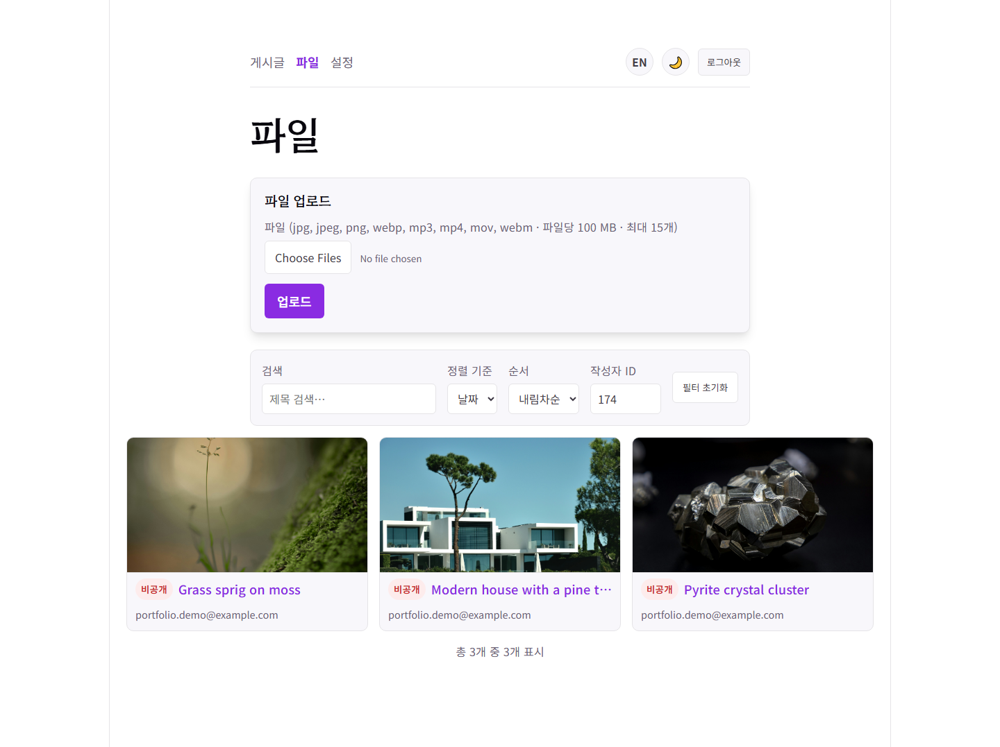
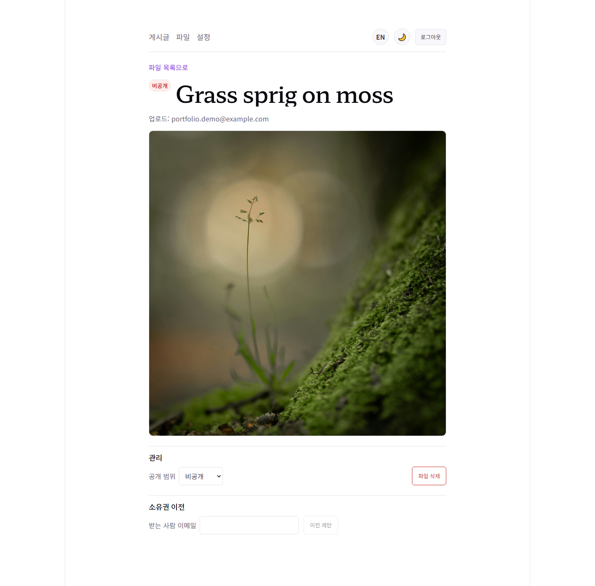
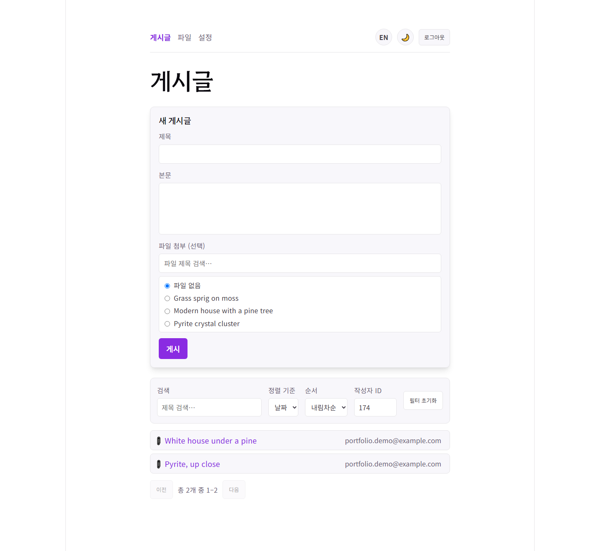
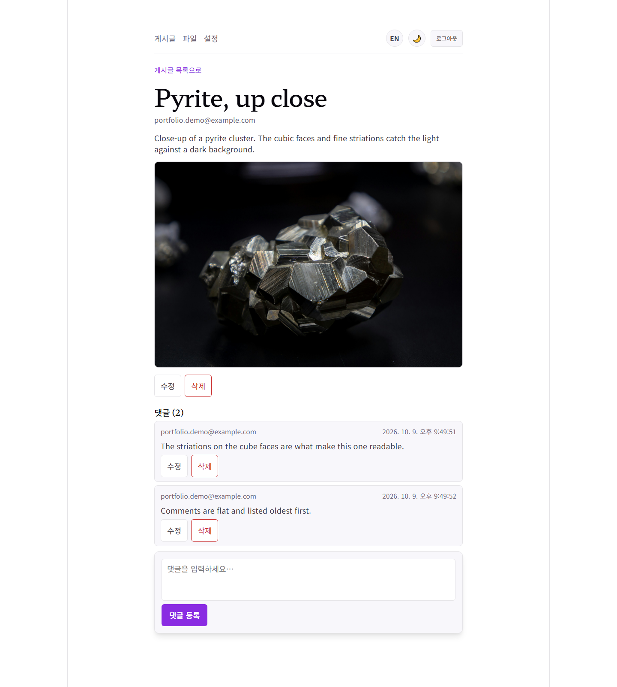
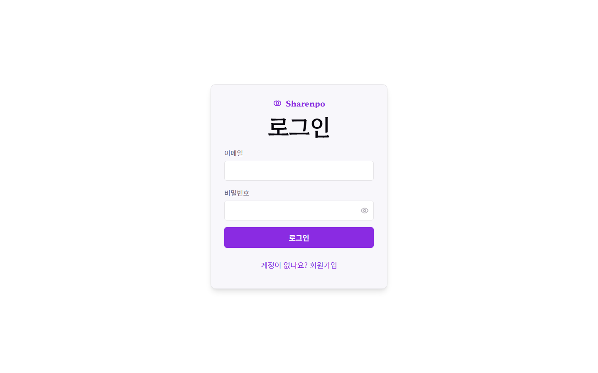
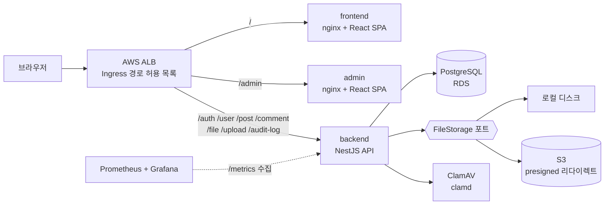
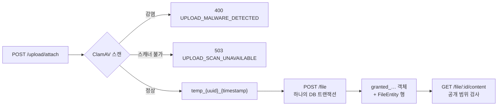

[](https://github.com/Bluecode77732/Upload-Board-Project/actions/workflows/ci.yml)


# Sharenpo

> English version: [README.md](README.md)

로그인한 사용자가 이미지·오디오·동영상을 업로드하고, 파일마다 볼 수 있는 사람을 정하고,
게시글과 댓글이 있는 게시판으로 공유하는 서비스입니다. NestJS API, React 클라이언트, 관리자
콘솔로 이루어져 있고, Helm과 Terraform으로 AWS/EKS에 배포하며 Prometheus와 Grafana로
관찰합니다.

- 기간: 첫 커밋 2025-12-17, 현재 진행 중
- 범위: 개발자 1인, [CLAUDE.ko.md](CLAUDE.ko.md)의 규약 아래 AI의 도움을 받아 진행 — 백엔드,
  `frontend/`, `admin/`, 컨테이너, CI, Helm, Terraform
- 이 README는 저장소 전체를 다룹니다. 백엔드는 저장소 루트에 있고, 클라이언트에는 각자의
  README가 있습니다([frontend/](frontend/README.ko.md), [admin/](admin/README.ko.md))

## 스크린샷

임시 데모 데이터를 넣은 로컬 스택, 한국어 UI, 라이트 테마로 찍었습니다. UI는 영어와 다크
테마도 지원합니다.

<table>
<tr>
<td width="50%"><br><sub><b>파일 보드</b> — 미리보기 그리드, 공개 범위 배지, 검색·정렬·작성자 필터</sub></td>
<td width="50%"><br><sub><b>파일 상세</b> — 접근 검사를 거친 재생, 공개 범위 설정, 소유권 이전</sub></td>
</tr>
<tr>
<td width="50%"><br><sub><b>게시판</b> — 파일을 붙일 수 있는 새 글 폼, 검색과 페이지네이션</sub></td>
<td width="50%"><br><sub><b>게시글 상세</b> — 첨부 미디어와 오래된 순의 평면 댓글 스레드</sub></td>
</tr>
<tr>
<td width="50%"><br><sub><b>관리자 콘솔</b> — 총계와 최근 감사 로그(관리자 UI는 영어만 지원)</sub></td>
<td width="50%"><br><sub><b>로그인</b> — Basic 토큰 로그인, 회원가입 전환, 비밀번호 표시/숨김</sub></td>
</tr>
</table>

## 문서

| 문서 | 목적 |
|---|---|
| [ARCHITECTURE.ko.md](docs/ARCHITECTURE.ko.md) | 모듈 구성, 요청 흐름, 엔티티, 관례 |
| [ADR/](docs/ADR/README.ko.md) | 아키텍처 결정 기록 — 설계 이면의 *이유* |
| [CHANGELOG.ko.md](docs/CHANGELOG.ko.md) | 버전 이력 |
| [ROADMAP.ko.md](docs/ROADMAP.ko.md) | 단계별 전체 프로젝트 계획과 알려진 공백 |
| [CONTRIBUTING.ko.md](docs/CONTRIBUTING.ko.md) | 개발 워크플로와 관례 |
| [CLAUDE.ko.md](CLAUDE.ko.md) | AI 협업 개발을 위한 운영 규약 |
| [frontend/README.ko.md](frontend/README.ko.md) | React 클라이언트 — 구조, 인증 모델, E2E |
| [admin/README.ko.md](admin/README.ko.md) | 관리자 콘솔 — 무엇을 어떻게 맞췄고 어디에 호스팅되는지 |
| [k8s/helm/README.ko.md](k8s/helm/README.ko.md) | Helm 차트 — values, 시크릿, NetworkPolicy |
| [k8s/infra/terraform/README.ko.md](k8s/infra/terraform/README.ko.md) | Terraform — 세 개의 state, apply·destroy 순서 |

각 문서에는 영어 원본(`.md`)과 한국어 버전(`.ko.md`)이 있습니다.

## 아키텍처

하나의 Helm 릴리스가 세 워크로드를 하나의 ALB 뒤에서 실행합니다. Ingress는 경로를 명시한
허용 목록이며, `/health`, `/metrics`, `/doc`은 Ingress로 라우팅되지 않습니다
([ADR 0058](docs/ADR/0058-ingress-path-allowlist.ko.md)).



업로드는 요청 두 번으로 이루어집니다. 첫 요청은 스캔한 뒤 `temp_` 파일로 임시 저장하고, 두 번째
요청은 하나의 트랜잭션으로 승격하면서 소유자와 공개 범위를 부여합니다
([ADR 0003](docs/ADR/0003-two-phase-upload-contract.ko.md)).



백엔드 모듈은 단일 책임 기준으로 나뉩니다. **Auth**(토큰), **User**, **File**(메타데이터와 공개
범위 검사), **Post**, **Comment**, **Upload**(임시 저장), **AuditLog**가 있고, 운영용 모듈로
**Storage**(로컬 디스크와 S3 어댑터를 가진 `FileStorage` 포트), **TempCleanup**(고아 파일
정리), **Health**, **Metrics**가 있습니다. 요청과 데이터 흐름은
[ARCHITECTURE.ko.md](docs/ARCHITECTURE.ko.md)를 참고하세요.

## 기능

- **인증** — HTTP Basic 토큰으로 등록하고 로그인하며, `type` 클레임을 가진 이중 시크릿
  JWT 액세스/리프레시 쌍을 발급합니다 ([ADR 0002](docs/ADR/0002-dual-secret-token-pair.ko.md))
- **2단계 업로드** — `temp_` → `granted_` 접두사 상태 머신으로 동작하며, DB insert와 물리 파일
  이동이 함께 커밋되거나 함께 롤백됩니다
  ([ADR 0003](docs/ADR/0003-two-phase-upload-contract.ko.md))
- **RBAC + 감사 로그** — `user`/`admin`/`superadmin` 역할이 있고, 소유권 검사가 "본인
  또는 admin"으로 확장되며, 역할 변경과 삭제가 감사됩니다
  ([ADR 0013](docs/ADR/0013-rbac-and-audit-log.ko.md)은
  [ADR 0007](docs/ADR/0007-ownership-checks-without-rbac.ko.md) 위에 쌓았습니다)
- **경계 검증** — 전역 `ValidationPipe`(`whitelist` + `forbidNonWhitelisted`)를 쓰고,
  직렬화된 엔티티는 `password`를 유출하지 않습니다
- **요청 횟수 제한** — 모든 라우트가 기본 분당 100회 제한을 받고, 한도는 라우트별로 따로
  셉니다. 앱 전체가 나눠 쓰는 풀 하나가 아닙니다(`@nestjs/throttler`가 컨트롤러+핸들러+
  클라이언트 IP를 키로 씁니다). `POST /auth/register`/`signin`/`token/refresh`는 분당 5회로,
  `POST /upload/attach`는 분당 15회로 더 엄격합니다. health/metrics 프로브는 제외되어
  오케스트레이터와 Prometheus 트래픽이 남용으로
  오인되지 않습니다([ADR 0053](docs/ADR/0053-global-rate-limiting.ko.md),
  [ADR 0054](docs/ADR/0054-per-route-rate-limit-tuning.ko.md))
- **Swagger** — `/doc`에서 전체 API 문서를 열람하고 수동으로 테스트할 수 있습니다
- **업로드 악성코드 스캔** — 모든 업로드는 디스크에 쓰기 전에 메모리 상태에서 ClamAV로
  스캔됩니다. 감염이 확인되면 거절하고, 스캐너에 연결할 수 없을 때도 검사를 건너뛰지 않고
  fail-closed로 처리합니다([ADR 0059](docs/ADR/0059-upload-malware-scanning-clamav.ko.md))
- **파일 공개 범위** — 모든 파일은 `public`, `private`(기본값), `unlisted` 중 하나입니다.
  unlisted 파일은 공유 링크로 열며, 링크의 토큰은 재발급하거나 만료 시각을 둘 수 있습니다.
  파일 바이트는 정적 폴더가 아니라 접근 검사를 거치는 `GET /file/:id/content`로만 서빙됩니다
  ([ADR 0025](docs/ADR/0025-file-visibility-and-media-expansion.ko.md),
  [ADR 0026](docs/ADR/0026-file-visibility-implementation.ko.md))
- **스토리지 포트** — 파일 작업은 `FileStorage` 인터페이스를 거치며, `STORAGE_DRIVER`로 로컬
  디스크 어댑터와 S3 어댑터 중 하나를 고릅니다. S3에서는 접근 검사를 통과하면 수명이 짧은
  presigned URL로 리다이렉트하므로 앱 서버가 바이트 서빙 경로에서 빠집니다
  ([ADR 0029](docs/ADR/0029-storage-port-adapter.ko.md),
  [ADR 0036](docs/ADR/0036-s3-presigned-content-redirect.ko.md))
- **게시판** — 파일을 선택적으로 첨부하는 게시글과 평면 댓글 스레드. 목록은 하나의 검색·필터·
  정렬·페이지네이션 규약을 공유합니다
  ([ADR 0021](docs/ADR/0021-list-query-search-filter-sort.ko.md),
  [ADR 0023](docs/ADR/0023-board-domain-schema.ko.md))
- **계정과 파일의 수명 주기** — 계정 삭제는 명시적으로 확인했을 때만 연쇄 삭제되고, 모든 삭제는
  설계상 되돌릴 수 없습니다([ADR 0020](docs/ADR/0020-account-deletion-cascade.ko.md)). 파일의
  소유자를 바꾸려면 받는 사람의 동의가 필요합니다 — 제안, 수락, 거절, 취소
  ([ADR 0050](docs/ADR/0050-consent-based-file-ownership-transfer.ko.md))
- **보안 강화** — 보안 응답 헤더([ADR 0055](docs/ADR/0055-helmet-security-headers.ko.md)),
  토큰 시크릿과 비밀번호의 강도 검사, non-root 컨테이너 이미지
  ([ADR 0030](docs/ADR/0030-container-non-root-and-arch-stance.ko.md)), 기본 차단 방식의
  NetworkPolicy([ADR 0056](docs/ADR/0056-networkpolicy-east-west-restriction.ko.md)), 앞서
  설명한 Ingress 경로 허용 목록
- **운영** — liveness/readiness 엔드포인트
  ([ADR 0031](docs/ADR/0031-health-and-readiness-endpoints.ko.md)), Grafana를 곁들인 Prometheus
  메트릭([ADR 0047](docs/ADR/0047-observability-prometheus-grafana.ko.md)), 고아 `temp_` 파일
  ([ADR 0018](docs/ADR/0018-orphan-temp-file-cleanup.ko.md))과 고아 `granted_` 파일의 주기적
  정리 — 후자는 운영자가 삭제를 켜기 전까지 보고만 합니다
  ([ADR 0051](docs/ADR/0051-orphaned-granted-file-reclaim.ko.md))
- **React 클라이언트(`frontend/`)** — 로그인과 회원가입, 댓글이 있는 게시판, 미리보기 그리드
  형태의 파일 보드, 미디어 종류별 재생, 공개 범위와 공유 링크 관리, 소유권 이전, 계정 삭제.
  업로드 폼은 파일을 최대 15개까지 한 번에 고르고 파일마다 진행률 표시줄을 보이며 하나씩
  보냅니다([ADR 0065](docs/ADR/0065-multi-file-upload-client-sequential.ko.md)). UI는 영어와
  한국어, 라이트와 다크 테마를 지원합니다
- **관리자 콘솔(`admin/`)** — 로그인, 총계와 최근 감사 로그가 있는 대시보드, 역할 관리가 있는
  사용자 목록, 감사 로그 뷰어. 같은 ALB의 `/admin` 아래에서 서빙됩니다
  ([ADR 0062](docs/ADR/0062-admin-same-alb-subpath-routing.ko.md))

## 기술 스택

| 계층 | 사용하는 것 |
|---|---|
| 백엔드 | NestJS 11(Express), TypeScript, PostgreSQL을 쓰는 TypeORM 0.3, 액세스·리프레시 시크릿을 따로 둔 Passport JWT, bcrypt, class-validator와 Joi, `@nestjs/throttler`, helmet, `prom-client`, `clamscan`, AWS SDK v3(S3와 presigned URL), Swagger |
| 트랜잭션 | 파일 이동이 DB 쓰기와 함께 커밋되어야 할 때는 수동 QueryRunner, 순수 DB 쓰기에는 `dataSource.transaction()`([ADR 0004](docs/ADR/0004-transaction-pattern-selection.ko.md)). `synchronize: false`이며 스키마는 TypeORM 마이그레이션으로 관리([ADR 0006](docs/ADR/0006-schema-policy-and-migration-adoption.ko.md)) |
| `frontend/` | React 19, Vite, React Router 7, TypeScript, CSS Modules, 평범한 `fetch` 래퍼 — 상태 관리나 데이터 패칭 라이브러리는 쓰지 않습니다 |
| `admin/` | React 19, Vite, React Router 7, Zustand, axios, TypeScript |
| 테스트 | 서비스를 대상으로 한 Jest 단위 테스트, 실제 PostgreSQL을 쓰는 백엔드 E2E, `frontend/`와 `admin/`의 Playwright E2E |
| 컨테이너와 CI | 멀티 스테이지 Docker 이미지(`main`에서는 `linux/amd64`와 `linux/arm64`), Docker Compose, GitHub Actions |
| 배포 | Helm 차트, 세 개의 state(`cluster`, `app-infra`, `addons`)로 나눈 Terraform — VPC, EKS, RDS, S3, Secrets Manager, Route 53과 ACM, ALB Controller, External Secrets, ExternalDNS, kube-prometheus-stack |

## 빠른 시작

사전 요건: Node.js 24([.nvmrc](.nvmrc) 참고)와 Corepack 기반 pnpm 10, 그리고
PostgreSQL 16 — 또는 그냥 Docker(아래 [Docker로 실행](#docker로-실행) 참고).

```bash
# 1. 의존성 설치
pnpm install

# 2. 환경 설정
cp .env.example .env        # DB 자격 증명과 토큰 시크릿을 채워 넣기
#    저장 폴더(file/temp/, file/upload/)는 더 이상 직접 만들 필요가 없습니다 —
#    LocalDiskStorage가 부팅 시 없으면 자동으로 생성합니다.

# 3. 데이터베이스 생성 후 마이그레이션으로 스키마 적용 (ADR 0006)
#    DB_DATABASE에 지정한 데이터베이스를 만든 뒤(createdb / pgAdmin):
#      pnpm migration:run
#    마이그레이션 도입 이전의 스키마를 이미 가진 데이터베이스라면:
#      pnpm migration:run -- --fake     # 베이스라인을 적용 완료로 표시(1회)

# 4. 개발 서버 실행 (포트 3000)
pnpm run start:dev

# 5. Swagger UI 열기
#    http://localhost:3000/doc

# 6. (선택) superadmin 계정 승격 — POST /auth/register로 먼저 계정을 만들고,
#    .env의 SUPERADMIN_EMAIL을 그 주소로 설정한 뒤:
#      pnpm promote-superadmin
#    (ADR 0013/0052 — 자동이 아니라 의도적인 수동 단계입니다)

# 테스트
pnpm test              # 단위 테스트
pnpm run test:cov      # 커버리지 (서비스만 측정)
```

### Docker로 실행

`docker compose`가 Postgres·ClamAV·API를 함께 띄웁니다
([ADR 0015](docs/ADR/0015-docker-and-compose.ko.md); ClamAV는
[ADR 0059](docs/ADR/0059-upload-malware-scanning-clamav.ko.md)에서 추가했습니다).
호스트 포트 5435를 점유하는 레거시 `upload-board-pg` 컨테이너를 먼저 멈추세요.

```bash
cp .env.example .env        # 시크릿을 채웁니다. DB_*는 compose용으로 그대로 둬도 됩니다
docker compose up --build   # db(postgres:16) + clamav → migrate(one-shot) → api를 :3000에 기동
```

`db` 서비스가 `${DB_PORT}`(5435)를 노출하므로, 호스트에서 돌리는 `pnpm test:e2e`와
`pnpm migration:*`도 같은 데이터베이스에 접속합니다. 마이그레이션은 `api`의 부팅 과정이
아니라 별도의 `migrate` 서비스로 실행됩니다([ADR 0032](docs/ADR/0032-migration-as-separate-deploy-step.ko.md))
— `api`는 `migrate`가 0으로 종료될 때까지 기다립니다. 이미지는 non-root 사용자로
실행됩니다([ADR 0030](docs/ADR/0030-container-non-root-and-arch-stance.ko.md)) — 네이티브
Linux 호스트에서 바인드 마운트된 `./file` 디렉터리에 쓰기가 실패하면 한 번
`chown`하세요: `sudo chown -R 1001:1001 file/` (Windows/Mac Docker Desktop은 영향을
받지 않습니다).

`.env`는 건드리지 않고 이 머신에서만 값을 바꾸려면 — 예를 들어 `.env`가 S3를 가리키는데 버킷이
없을 때 `STORAGE_DRIVER=local` — gitignore된 `.env.local`에 적으세요. `api`와 `migrate`가
`.env` 뒤에 이 파일을 읽고, 호스트에서 돌리는 백엔드도 읽습니다
([ADR 0015](docs/ADR/0015-docker-and-compose.ko.md) 2026-10-03 Addendum, Compose 2.24 이상 필요).

### AWS / Kubernetes 배포

백엔드·`frontend/`·`admin/`은 하나의 ALB 뒤에서 하나의 Helm 릴리스로 배포됩니다
([ADR 0060](docs/ADR/0060-frontend-same-alb-path-routing.ko.md),
[ADR 0062](docs/ADR/0062-admin-same-alb-subpath-routing.ko.md)). 실행 방법은 세 가지이고,
정확한 플래그와 선행 조건은
[k8s/infra/terraform/README.md](k8s/infra/terraform/README.ko.md)와
[k8s/helm/README.md](k8s/helm/README.ko.md)에 있습니다.

| 방법 | 명령 | 쓰는 경우 |
|---|---|---|
| 1. 스크립트 | `bash k8s/infra/terraform/deploy.sh all` (또는 `cluster` / `app-infra` / `addons` / `helm [브랜치]`를 하나씩) | 기본 경로. Terraform 세 state를 순서대로 적용한 뒤, 세 이미지에 같은 `:<git-sha>`를 넣어 `helm upgrade --install`을 실행합니다([ADR 0046](docs/ADR/0046-deploy-sequence-automation.ko.md)) |
| 2. 직접 실행 | `cluster/` → `app-infra/` → `addons/` 각 디렉터리에서 `terraform init -backend-config="bucket=<state-bucket>"`, `plan`, `apply`를 실행한 뒤 `k8s/helm`에서 `helm upgrade --install` | 스크립트를 쓰고 싶지 않을 때 — 스크립트가 감싸고 있는 순서 그대로입니다 |
| 3. Helm만 | `k8s/helm`에서 `helm upgrade --install sharenpo . -f values-prod.yaml --set image.tag=<sha> --set frontend.image.tag=<sha> --set admin.image.tag=<sha>` | 인프라가 이미 떠 있고 앱 Secret도 있어서, 재배포하거나 이전 sha로 롤백하기만 하면 될 때 |

`deploy.sh`는 모든 `apply` 전에 명시적으로 `y`를 입력받아야 멈추지 않고 진행합니다 —
`-auto-approve`는 없습니다. 세 방법 모두 도메인 구매/NS 위임, 1회성 External Secrets
동기화, `ingress.enabled` 켜기는 다루지 않으며, 이 셋은 계속 수동입니다(Terraform README
참고).

**CI는 배포하지 않습니다.** GitHub Actions는 세 이미지(`bluecode1775/sharenpo`,
`-frontend`, `-admin`)를 Docker Hub에 발행할 뿐이고
([ADR 0048](docs/ADR/0048-ci-trigger-restoration-and-docker-publish-design.ko.md)), 이
저장소에서 `terraform apply`나 `helm upgrade`를 자동으로 실행하는 것은 없습니다.

이 스택은 실제 AWS에 적용해 여러 번 검증했습니다. 지금 떠 있는지는 이 README에 적지
않습니다. `apply`나 `destroy`를 실행하는 순간 낡아 버리기 때문입니다. 날짜별 기록은
[ROADMAP.ko.md](docs/ROADMAP.ko.md) §9에 있고, 실제 상태는 AWS에서 직접 확인합니다.

### 환경변수

필수 (부팅 시 Joi 검증 — 누락 시 즉시 실패): `ENV`, `DB_TYPE`(`postgres`),
`DB_HOST`, `DB_PORT`, `DB_USERNAME`, `DB_PASSWORD`, `DB_DATABASE`, `HASH_ROUNDS`,
`ACCESS_TOKEN_SECRET`, `REFRESH_TOKEN_SECRET`, `ACCESS_TOKEN_SECRET_EXPIRES_IN`,
`REFRESH_TOKEN_SECRET_EXPIRES_IN`. 2026-09-11부터 이 중 세 개는 존재 여부를 넘어선
검증도 받습니다. `HASH_ROUNDS`는 10 이상이어야 하고, `ACCESS_TOKEN_SECRET`/
`REFRESH_TOKEN_SECRET`은 각각 32자 이상이면서 대문자·소문자·숫자·기호를 모두
포함해야 합니다. 기준에 못 미치면 부팅 시 해당 필드명이 명시된 Joi 에러로 막힙니다.

선택 항목은 모두 Joi로 기본값을 검증하거나 각자의 조건에 따라 켜집니다(예시를 포함한 전체
목록은 `.env.example` 참고): `BASE_URL`(기본 `http://localhost:3000`; 공개 파일 URL
조합에 사용), `PORT`(기본 `3000`), `CORS_ORIGIN`(미설정 = CORS 비활성; 콤마 구분
허용 목록 — [ADR 0008](docs/ADR/0008-opt-in-cors.ko.md); 배포된 `frontend/`는 이 값을
설정하지 않습니다 — API와 같은 ALB 뒤에서 same-origin으로 동작하기 때문입니다,
[ADR 0060](docs/ADR/0060-frontend-same-alb-path-routing.ko.md) — `admin/`의 개발 서버나
다른 cross-origin 소비자에게는 여전히 필요합니다), `SUPERADMIN_EMAIL`(미설정 =
비활성; 수동 `pnpm promote-superadmin` 단계의 대상 계정일 뿐 부팅 시 자동으로
승격되지는 않습니다 —
[ADR 0013](docs/ADR/0013-rbac-and-audit-log.ko.md)/[ADR 0052](docs/ADR/0052-superadmin-seed-manual-trigger.ko.md)), `TEMP_SWEEP_ENABLED` /
`TEMP_SWEEP_CRON` / `TEMP_SWEEP_TTL_HOURS` / `TEMP_SWEEP_DRY_RUN`(고아 temp 파일
정리 — [ADR 0018](docs/ADR/0018-orphan-temp-file-cleanup.ko.md)), `STORAGE_DRIVER`
(`local` 기본 | `s3`, `s3`일 때 `S3_BUCKET`/`AWS_REGION` 필수 —
[ADR 0029](docs/ADR/0029-storage-port-adapter.ko.md)), `CONTENT_SIGNED_URL_TTL_SECONDS`
(S3 presigned 리다이렉트 TTL, `local`에서는 미사용 —
[ADR 0036](docs/ADR/0036-s3-presigned-content-redirect.ko.md)), `CLAMD_HOST` /
`CLAMD_PORT`(기본값 `clamav` / `3310`, `docker-compose.yml`의 서비스명과 동일 —
업로드 악성코드 스캔, [ADR 0059](docs/ADR/0059-upload-malware-scanning-clamav.ko.md)),
그리고
`THROTTLE_ENABLED`(기본값 `true` — dev/prod를 가르는 스위치가 아니라 e2e 스위트가
전역 제한과 라우트별 auth/upload 강화 제한을 함께 우회하기 위한 용도로만 존재 —
[ADR 0053](docs/ADR/0053-global-rate-limiting.ko.md),
[ADR 0054](docs/ADR/0054-per-route-rate-limit-tuning.ko.md)).

## API 엔드포인트

`/auth/*`, 운영용 `/health/*`와 `/metrics`, 그리고 파일의 공개 범위에 따라 접근이 갈리는
`GET /file/:id/content`(토큰은 선택)를 제외한 모든 엔드포인트는 Bearer 액세스 토큰이
필요합니다. 전체 라우트는 `/doc`의 Swagger에서 볼 수 있습니다.

**인증** — 리프레시 토큰은 httpOnly 쿠키(`SameSite=Strict`,
`Path=/auth/token`)로만 이동합니다; 브라우저는 refresh/signout 호출에
`credentials: 'include'`가 필요합니다
([ADR 0012](docs/ADR/0012-refresh-cookie-rotation.ko.md))
- `POST /auth/register` — Basic 토큰으로 등록 (`base64(email:password)`)
- `POST /auth/signin` — `{ accessToken }` + 리프레시 쿠키 발급 (Basic 토큰)
- `POST /auth/token/refresh` — 리프레시 쿠키를 회전시키고 새 액세스 토큰 반환;
  회수된 토큰을 재사용하면 세션이 무효화됩니다(`AUTH_REFRESH_REUSED`)
- `POST /auth/signout` — 서버 측 세션 앵커 무효화 + 쿠키 삭제 (Bearer 액세스 토큰)

**사용자** — 사용자 생성은 `POST /auth/register`이며 `POST /user`는 없습니다.
역할: `user` / `admin` / `superadmin` ([ADR 0013](docs/ADR/0013-rbac-and-audit-log.ko.md))
- `GET /user` — 사용자 목록 (admin만). `take`(1–100, 기본 20), `skip`(기본 0)로
  페이지네이션하며, `search`는 email에 대한 대소문자 구분 없는 부분일치입니다(와일드카드는
  이스케이프됩니다). `sortBy`(`createdAt`|`email`|`id`, 기본 `createdAt`)와
  `order`(`ASC`|`DESC`, 기본 `DESC`)로 정렬을 제어하며, `id`가 항상 tiebreaker로
  덧붙습니다 — `GET /file`이 이미 갖고 있는 것과 같은 검색/정렬 형태입니다
  ([ADR 0021](docs/ADR/0021-list-query-search-filter-sort.ko.md)). 선언되지 않은 쿼리
  파라미터는 조용히 무시되지 않고 400 `VALIDATION_FAILED`로 거부됩니다 — 전역
  `ValidationPipe`의 `forbidNonWhitelisted`가 `?orderby=email` 같은 오타를 오류로
  취급합니다. 응답은 `GET /file`과 동일한 `[users, totalCount]` 튜플입니다
- `GET /user/lookup?email=` — 정확히 일치하는 이메일로 사용자를 조회합니다. 로그인한 사용자라면
  누구나 호출할 수 있고, 공개되는 정보 수준은 `GET /user/:id`와 같습니다. 그 이메일의 계정이
  없으면 404 `USER_NOT_FOUND`입니다. 소유권 이전 폼이 받는 사람을 찾는 데 씁니다
  ([ADR 0050](docs/ADR/0050-consent-based-file-ownership-transfer.ko.md))
- `GET /user/:id` — 사용자 조회
- `PATCH /user/:id` — 사용자 수정 (본인, 또는 자신보다 낮은 role의 계정에 대해서만 동작하는
  admin/superadmin — admin은 동급 admin이나 superadmin을 수정할 수 없습니다)
- `PATCH /user/:id/role` — 역할 부여 (superadmin만; 마지막 superadmin은 강등 불가)
- `DELETE /user/:id` — 사용자 삭제 (본인, 또는 위와 동일한 동급/상위 role 제한이 적용되는
  admin/superadmin). 파일을 보유한 계정은 409
  `USER_HAS_FILES`로 거절되며, `?deleteFiles=true`로 연쇄 삭제를 확인해야 계정과 파일을
  함께 삭제합니다 — 되돌릴 수 없습니다 ([ADR 0020](docs/ADR/0020-account-deletion-cascade.ko.md)).
  해당 계정의 **게시글은 별도 확인 없이 항상 함께 삭제됩니다** — 이 플래그가 지키는 대상은
  미디어 바이트뿐이기 때문입니다 ([ADR 0023](docs/ADR/0023-board-domain-schema.ko.md)). 확인을
  거쳤더라도 그 계정의 파일이 *다른 사용자의* 게시글에 걸려 있으면 409 `USER_FILES_IN_USE`로
  거절됩니다 — 그 게시글을 먼저 지워야 합니다
  ([ADR 0024](docs/ADR/0024-account-cascade-fk-refusal.ko.md))

**파일**
- `POST /upload/attach` — 파일을 임시 저장소로 업로드 (100 MB 제한). 각자 고유한 클래스
  허용 목록을 가진 세 멀티파트 필드 중 정확히 하나: `image`(jpg/jpeg/png/webp), `audio`
  (mp3), `video`(mp4/mov/webm). 필드가 0개면 400 `UPLOAD_FILE_REQUIRED`, 2개 이상이면 400
  `UPLOAD_MULTIPLE_FIELDS`, 필드의 허용 목록과 맞지 않는 파일이면 400
  `UPLOAD_INVALID_TYPE` ([ADR 0025](docs/ADR/0025-file-visibility-and-media-expansion.ko.md)
  D4/D5, [ADR 0027](docs/ADR/0027-media-type-expansion-implementation.ko.md)). temp
  저장소에 도달하기 전에 ClamAV(`clamd`)로 스캔되며, 감염이 확인되면 400
  `UPLOAD_MALWARE_DETECTED`, 스캐너에 연결할 수 없거나 타임아웃되면 검사를 건너뛰지
  않고 503 `UPLOAD_SCAN_UNAVAILABLE`로 fail-closed 처리합니다
  ([ADR 0059](docs/ADR/0059-upload-malware-scanning-clamav.ko.md))
- `GET /file` — 파일 목록. 모든 쿼리 파라미터는 선택적이며 함께 조합할 수 있습니다. 선언되지 않은
  파라미터는 400 `VALIDATION_FAILED`로 거절됩니다
  ([ADR 0021](docs/ADR/0021-list-query-search-filter-sort.ko.md))

  | 파라미터 | 허용 값 | 기본값 |
  |---|---|---|
  | `take` | 1–100 | `20` |
  | `skip` | 0 이상 | `0` |
  | `search` | 제목 부분일치, 대소문자 무시, 100자 이하 (`%`와 `_`는 문자 그대로 매칭) | — |
  | `sortBy` | `createdAt` \| `title` \| `id` | `createdAt` |
  | `order` | `DESC` \| `ASC` | `DESC` |
  | `creatorId` | 유저 id | — |

  예: `GET /file?search=holiday&creatorId=3&sortBy=title&order=ASC&take=10`
- `GET /file/:id` — 파일 메타데이터 조회. `private`/`unlisted` 파일은 작성자·admin 외에게는
  404 `FILE_NOT_FOUND`로 답하며, 존재 자체를 숨깁니다
  ([ADR 0025](docs/ADR/0025-file-visibility-and-media-expansion.ko.md),
  [ADR 0026](docs/ADR/0026-file-visibility-implementation.ko.md))
- `GET /file/:id/content` — 저장된 파일 바이트를 스트리밍하며, `visibility`로 접근을
  검사합니다. `public`은 인증이 필요 없고, `private`은 작성자·admin의 Bearer 토큰이 필요하며(아니면 403
  `FORBIDDEN_NOT_OWNER`), `unlisted`는 일치하는 `?share=<token>`이 필요합니다(로그인은 필요 없고, 누락·오류·
  만료 시 403 `FILE_SHARE_INVALID`). 영상/오디오 탐색을 위한 `Range` 요청을 지원합니다.
  granted 바이트를 서빙하는 **유일한** 경로입니다 — `ServeStaticModule`은 더 이상 `file/upload`를
  노출하지 않습니다
  ([ADR 0025](docs/ADR/0025-file-visibility-and-media-expansion.ko.md) D1/D2,
  [ADR 0026](docs/ADR/0026-file-visibility-implementation.ko.md)). `STORAGE_DRIVER=s3`에서는
  접근 검사를 통과하면 바이트를 직접 스트리밍하는 대신 수명이 짧은 presigned S3 URL로
  `302` 리다이렉트합니다 — 기본값인 `local` 드라이버에서는 동작이 그대로입니다
  ([ADR 0036](docs/ADR/0036-s3-presigned-content-redirect.ko.md))
- `POST /file` — 임시 파일을 영구 저장소로 승격 (트랜잭션), 기본 `visibility: private`로
  시작합니다. attach로 받은 파일명은 1회용 청구 토큰이라, 다시 제출하면 청구한 본인에게는 기존
  파일을 200으로 돌려주고(멱등 재시도), 다른 사용자에게는 409 `FILE_ALREADY_CLAIMED`를
  반환합니다 ([ADR 0019](docs/ADR/0019-upload-claim-idempotency.ko.md)). 응답의 `mediaType`
  (`image`/`audio`/`video`)은 파일 확장자로부터 서버가 판정하며, 클라이언트가 보내는 값이
  아닙니다 ([ADR 0040](docs/ADR/0040-persisted-media-type-for-playback.ko.md))
- `PATCH /file/:id` — 파일 메타데이터 수정 (작성자 또는 admin). `visibility` 토글도 여기서 합니다.
  `unlisted`로 전환하면 `shareToken`이 발급되어 `shareUrl`로 반환됩니다(소유자·admin에게만).
  `rotateShareToken: true`는 이를 재발급해 이전에 공유된 링크를 모두 무효화합니다. 선택적
  `shareExpiresAt`으로 만료 시각을 둘 수 있습니다(기본: 만료 없음)
  ([ADR 0025](docs/ADR/0025-file-visibility-and-media-expansion.ko.md) D3)
- `DELETE /file/:id` — 파일 메타데이터와 저장된 물리 파일 삭제 (작성자 또는 admin). 게시글이
  참조 중인 파일은 409 `FILE_IN_USE`로 거절되므로 게시글을 먼저 지워야 합니다
  ([ADR 0023](docs/ADR/0023-board-domain-schema.ko.md))
- `POST /file/:id/transfer` — 파일을 다른 사용자에게 넘기자고 제안합니다(`{ userId }`, 작성자 또는
  admin). 이 시점에는 아무것도 옮겨지지 않습니다. 대상이 이미 소유자면 400
  `FILE_TRANSFER_INVALID_TARGET`, 없는 대상이면 404 `USER_NOT_FOUND`, 이미 대기 중인 제안이
  있으면 409 `FILE_TRANSFER_PENDING`
  ([ADR 0050](docs/ADR/0050-consent-based-file-ownership-transfer.ko.md))
- `POST /file/:id/transfer/accept`, `POST /file/:id/transfer/reject` — 대기 중인 제안에 응답합니다.
  제안받은 사용자만 응답할 수 있고 admin도 대신할 수 없습니다(403
  `FORBIDDEN_NOT_TRANSFER_TARGET`). 수락하면 소유권이 호출자에게 옮겨지며, 대기 중인 제안이
  없으면 400 `FILE_NO_PENDING_TRANSFER`
- `DELETE /file/:id/transfer` — 아직 응답이 없는 제안을 취소합니다. 파일의 작성자만 취소할 수 있고,
  admin도 남의 제안은 취소할 수 없습니다(403 `FORBIDDEN_NOT_OWNER`)

**게시글** — 게시판 본체 ([ADR 0023](docs/ADR/0023-board-domain-schema.ko.md)). 게시글은 본문과 함께
작성자 본인이 올린 파일 **하나**를 선택적으로 참조합니다. 참조일 뿐 소유가 아니므로 게시글을 지워도
파일은 그대로 남습니다
- `GET /post` — 게시글 목록. 쿼리 파라미터 규약은 위 `GET /file`과 동일합니다
  (`take` / `skip` / `search` / `sortBy` / `order` / `creatorId`, 기본값도 같습니다)
- `GET /post/:id` — 작성자와 첨부 파일을 포함한 게시글 조회
- `POST /post` — 게시글 작성 (`{ title, body, fileId? }`). `fileId`는 요청자 본인이 만든 파일이어야
  하고(아니면 403 `FORBIDDEN_NOT_OWNER`, 없는 id면 404 `FILE_NOT_FOUND`), 다른 게시글이 이미
  점유하지 않은 것이어야 합니다. 이 제약이 곧 멱등 키 역할을 합니다 — **완전히 동일한** 본문으로 다시
  제출하면 기존 게시글을 200으로 돌려주고, 같은 `fileId`에 본문이 다르면 409 `POST_FILE_TAKEN`입니다.
  `fileId` 없는 게시글은 자연 키가 없어 재제출 시 새 글이 만들어집니다
- `PATCH /post/:id` — `title` / `body` 수정 (작성자 또는 admin). 첨부는 작성 시점에 고정되므로,
  영상을 떼려면 게시글을 삭제해야 합니다
- `DELETE /post/:id` — 게시글 삭제 (작성자 또는 admin), 되돌릴 수 없습니다. 그 글의 댓글은 FK 연쇄로
  함께 사라지지만, 첨부 파일은 그대로 남습니다

**댓글** — 게시글 아래 스레드 ([ADR 0023](docs/ADR/0023-board-domain-schema.ko.md)). 평면 구조이며
대댓글은 없습니다
- `GET /post/:postId/comment` — 한 게시글의 댓글 목록, **오래된 순**(최신순인 파일·게시글 목록과
  반대입니다. 정렬은 고정이라 정렬 파라미터를 받지 않습니다). `take` / `skip`으로 페이지네이션합니다.
  없는 글이면 404 `POST_NOT_FOUND`
- `POST /post/:postId/comment` — 댓글 작성 (`{ body }`, 1,000자 이하). 글이 없으면 404
  `POST_NOT_FOUND`. 댓글에는 유니크한 컬럼이 없어 멱등 키도 없으므로, 동일한 내용을 다시 제출하면
  **두 번째** 댓글이 만들어집니다
- `PATCH /comment/:id` — `body` 수정 (작성자 또는 admin)
- `DELETE /comment/:id` — 댓글 삭제 (작성자 또는 admin), 되돌릴 수 없습니다. 게시글은 그대로입니다

게시글 작성자라고 해서 자기 글의 댓글에 **특별한 권한을 얻지는 않습니다** — 수정과 삭제는 댓글
작성자 본인이나 admin의 몫이며, 그 외 누구의 것도 아닙니다.

**감사 로그**
- `GET /audit-log` — ROLE_CHANGE / USER_DELETE / FILE_DELETE / POST_DELETE / COMMENT_DELETE 기록 조회 (admin만; 페이지네이션, `?action` 필터). `?userId`는 해당 유저가 actor이거나, **유저를 대상으로 하는** action의 target인 기록만 반환합니다 — `targetId`는 다형이므로 대상이 파일·게시글·댓글인 기록은 actor 쪽으로만 매칭됩니다([ADR 0045](docs/ADR/0045-audit-log-target-type.ko.md)). 둘 다 주어지면 두 필터가 AND로 묶입니다

**헬스 체크** (운영용 — 애플리케이션 소비자가 아니라 로드밸런서/오케스트레이터
프로브를 위한 것이며, 설계상 인증이 없습니다, [ADR 0031](docs/ADR/0031-health-and-readiness-endpoints.ko.md))
- `GET /health/live` — 프로세스가 살아 있는지만 확인하고 의존성은 검사하지 않습니다
- `GET /health/ready` — 추가로 DB 연결을 확인하며, 연결할 수 없으면 503입니다

**메트릭** (운영용 — 애플리케이션 소비자가 아니라 Prometheus 스크레이프를
위한 것이며, 설계상 인증이 없습니다, [ADR 0047](docs/ADR/0047-observability-prometheus-grafana.ko.md))
- `GET /metrics` — Prometheus exposition 포맷: 기본 프로세스 지표, 요청당
  지연(`http_request_duration_seconds`), 앱 카운터(`upload_claims_total`,
  `temp_cleanup_deleted_total`)

### 일반적인 흐름

```
POST /auth/register   (Basic)          → 사용자 생성
POST /auth/signin     (Basic)          → { accessToken } + Set-Cookie: refreshToken (httpOnly)
POST /upload/attach   (Bearer, image/audio/video 중 하나) → { filename: "temp_..." }
POST /file            (Bearer, { title, filePath: "temp_..." })
                                       → 승격(visibility: private); {BASE_URL}/file/:id/content로
                                         서빙 (PATCH /file/:id로 public/unlisted를 설정하기
                                         전까지는 Bearer 필요)
```

### 에러 응답

모든 에러는 동결된 기계 판독 가능 형태를 따릅니다
([ADR 0011](docs/ADR/0011-error-code-contract.ko.md)):

```json
{
  "statusCode": 400,
  "code": "FILE_TITLE_TAKEN",
  "message": "Title already in use.",
  "timestamp": "2026-07-23T09:00:00.000Z",
  "path": "/file/1"
}
```

분기는 반드시 `code`(안정 계약 — `backend/common/error-code.ts` 참조)로만 하고,
`message`(언제든 변경 가능)로는 하지 마세요. 검증 실패는
`code: "VALIDATION_FAILED"`에 `message` 배열이 오고, `ENV=dev`에서는 `stack`
필드가 추가됩니다.

전체 요청·데이터 흐름은 [ARCHITECTURE.ko.md](docs/ARCHITECTURE.ko.md)를 참조하세요.

## 테스트와 CI

- **단위 테스트** — Jest, 소스 파일 옆의 `*.spec.ts`. 커버리지는 서비스만 측정하고, 리포지토리와
  QueryRunner는 모킹하므로 데이터베이스가 필요 없습니다(`pnpm test`).
- **백엔드 E2E** — `pnpm test:e2e`는 실제 앱을 실제 PostgreSQL에 붙여 실행합니다. 실제
  마이그레이션으로 일회용 `sharenpo_e2e` 데이터베이스를 만들고, 테스트 사이에 비우고, 끝나면
  삭제합니다. 개발용 데이터베이스는 건드리지 않습니다.
- **클라이언트 E2E** — `frontend/`와 `admin/`의 Playwright(각 폴더의 README 참고).
- **GitHub Actions**([ADR 0016](docs/ADR/0016-github-actions-ci.ko.md),
  [ADR 0048](docs/ADR/0048-ci-trigger-restoration-and-docker-publish-design.ko.md)) — lint와 단위
  테스트, PostgreSQL·ClamAV 서비스 컨테이너를 붙인 백엔드 E2E, 클라이언트별 lint와 E2E를 거친 뒤
  백엔드·`frontend/`·`admin/` 이미지를 발행합니다. 이미지를 푸시하기 전에, 빌드한 이미지를 일회용
  데이터베이스에 붙여 부팅하고 `HEALTHCHECK`가 healthy가 될 때까지 확인합니다.
- 배포 파이프라인과 git 훅은 없습니다. CI는 이미지를 발행하는 데서 끝납니다.

## 알려진 한계

아직 열려 있는 항목이며, 각각 발견한 곳에 기록되어 있습니다. 전체 목록은
[ROADMAP.ko.md](docs/ROADMAP.ko.md) §7과 CLAUDE.md > Known Gaps에 있습니다.

- **"스캔 불가" 결과가 업로드 게이트를 통과합니다.** `clamd`가 빈 응답으로 연결을 닫거나 명령이
  타임아웃되면 `clamscan`이 `isInfected: null`을 돌려줄 수 있는데, 게이트가 이를 정상으로 읽어
  파일이 스캔 없이 저장됩니다. 연결 오류와 스캐너 불가는 여전히 fail-closed입니다. 소스를 읽어
  확인한 것이고 실제 `clamd`로 재현하지는 않았으며, 고칠 범위는 작게 정해져 있습니다
  ([ADR 0059](docs/ADR/0059-upload-malware-scanning-clamav.ko.md), 2026-10-03 Addendum).
- **청구 전 업로드 파일명이 업로더에게 묶여 있지 않습니다.** `POST /upload/attach`와 첫
  `POST /file` 사이에는 `temp_` 파일명을 아는 로그인 사용자 누구나 그 파일을 청구할 수 있고,
  원래 업로더는 409 `FILE_ALREADY_CLAIMED`를 받습니다. 로컬에서 재현했습니다. 위험은 낮게
  평가했습니다. 파일명에 v4 UUID가 들어 있고, 요청·응답 본문으로만 오가며, temp 정리 주기(기본
  24시간)와 함께 사라지기 때문입니다
  ([ADR 0019](docs/ADR/0019-upload-claim-idempotency.ko.md), 2026-10-06 Addendum).
- **브라우저 탭 사이에서 refresh가 경합할 수 있습니다.** 서버는 계정당 refresh 앵커를 하나만
  두고 유예 시간이 없습니다. 클라이언트는 한 탭 안에서만 refresh를 직렬화하므로, 두 탭이
  동시에 refresh하면 세션이 끝날 수 있습니다. 한 번 시도했을 때는 재현되지 않았습니다.
- **끊긴 업로드는 처음부터 다시 보내야 합니다.** 업로드 하나가 버퍼링된 요청 하나이고, 이어
  올리기나 청크 업로드는 없으며 설계도 하지 않았습니다.
- **게시글 하나는 파일을 최대 하나만 참조합니다.** 한 게시글에 파일 여러 개를 붙이는 것은 아직
  결정하지 않은 스키마 변경입니다
  ([ADR 0065](docs/ADR/0065-multi-file-upload-client-sequential.ko.md) D5).
- **회원가입은 이미 쓰는 이메일임을 알려 줍니다**(`AUTH_EMAIL_TAKEN`). 로그인은 실패 이유를
  숨깁니다. 저울질한 끝에 그대로 두기로 했습니다. 클라이언트가 이 코드로 구체적인 안내를
  보여 주고 있고, 분당 5회 제한이 유일한 완화책입니다([ROADMAP.ko.md](docs/ROADMAP.ko.md) §7).
- **요청 횟수 카운터는 인스턴스 메모리에 있습니다.** 레플리카가 둘 이상이면 하나의 진짜 상한을
  지키려고 공유 저장소가 필요합니다([ADR 0053](docs/ADR/0053-global-rate-limiting.ko.md)).
- **전달은 이미지 발행에서 멈춥니다.** 배포는 사람이 실행합니다. 서비스 메시(Istio)는 일부러
  넣지 않았습니다. 이 프로젝트는 백엔드 워크로드가 하나뿐이라 메시가 관리할 서비스 간 트래픽이
  없기 때문입니다.
- **의존성.** 2026-10-09에 `pnpm audit --prod`는 알려진 취약점을 찾지 못했습니다. 같은 날 일반
  `pnpm audit`는 65건(심각 3건)을 보고했고, 모두 빌드·테스트 도구에 있습니다.

## 라이선스

[MIT](LICENSE)

## 작성자

BLUECODE77732 — https://github.com/Bluecode77732
