[](https://github.com/Bluecode77732/Upload-Board-Project/actions/workflows/ci.yml)


# Sharenpo

> 한국어 버전: [README.ko.md](README.ko.md)

A service where signed-in users upload images, audio and video, choose who can see each file,
and share them on a board with posts and comments. It is a NestJS API, a React client and an
admin console, deployed to AWS/EKS with Helm and Terraform and observed with Prometheus and
Grafana.

- Timeline: first commit 2025-12-17, still in progress
- Scope: one developer, AI-assisted under the contract in [CLAUDE.md](CLAUDE.md) — backend,
  `frontend/`, `admin/`, containers, CI, Helm and Terraform
- This README covers the whole repository. The backend sits at the repo root; the clients have
  their own READMEs ([frontend/](frontend/README.md), [admin/](admin/README.md))

## Screenshots

Local stack with throwaway demo data, English UI, light theme. The UI also runs in Korean and
in a dark theme. The last four pictures (public and unlisted files, video and audio) were taken
in a browser that relaxed one local-only header; see [Known limitations](#known-limitations).

<table>
<tr>
<td width="50%">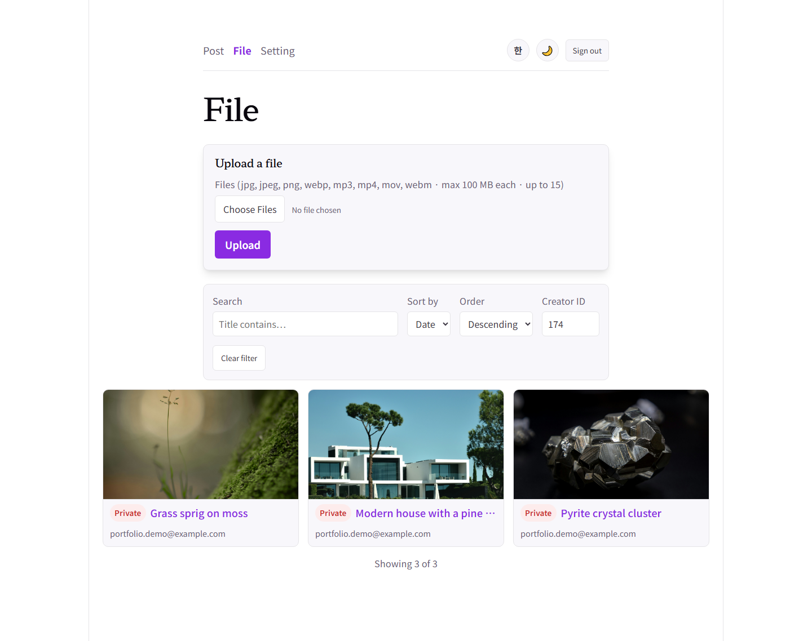<br><sub><b>File board</b> — preview grid, visibility badges, search, sort and creator filter</sub></td>
<td width="50%">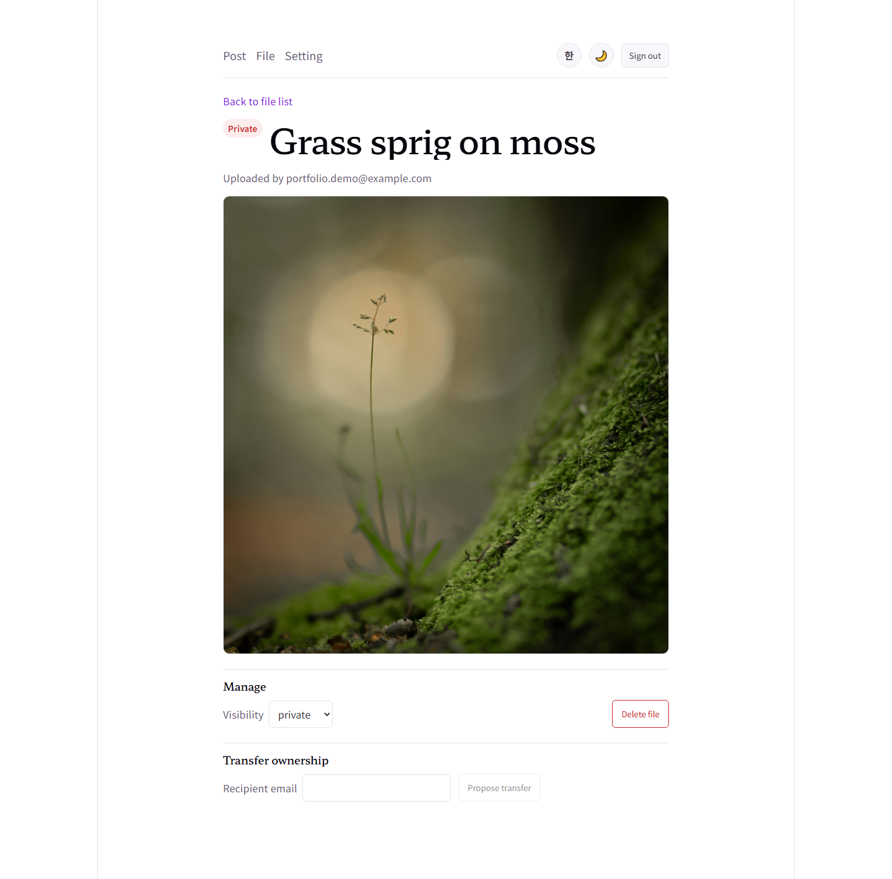<br><sub><b>File detail</b> — access-checked playback, visibility control, ownership transfer</sub></td>
</tr>
<tr>
<td width="50%">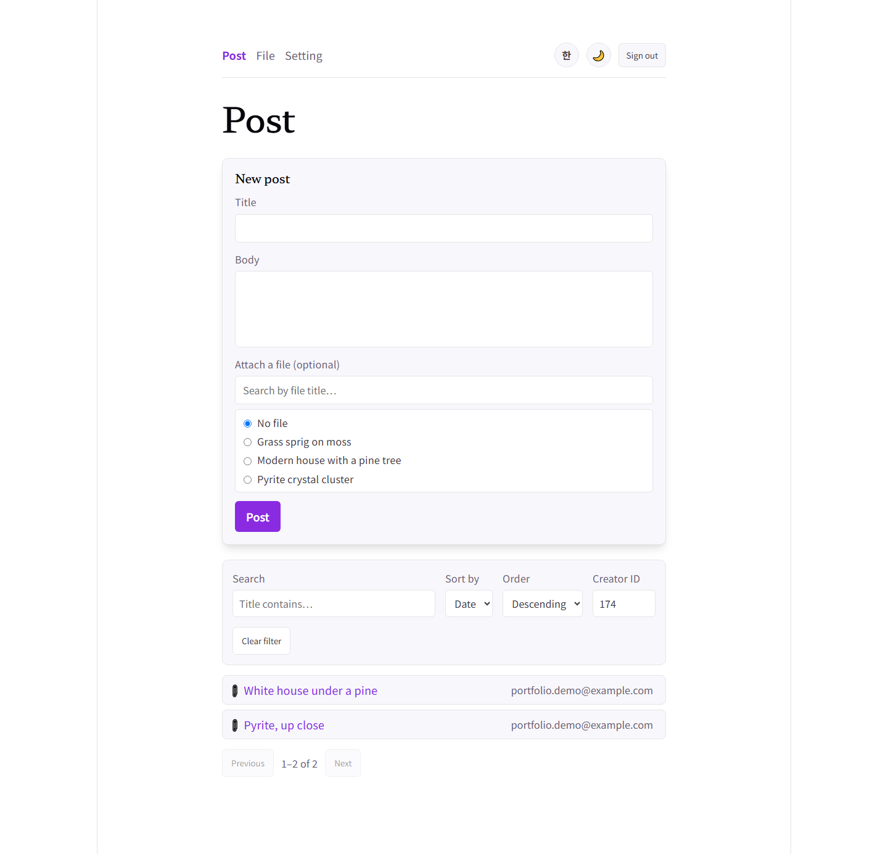<br><sub><b>Post board</b> — new post with an optional attached file, search and pagination</sub></td>
<td width="50%">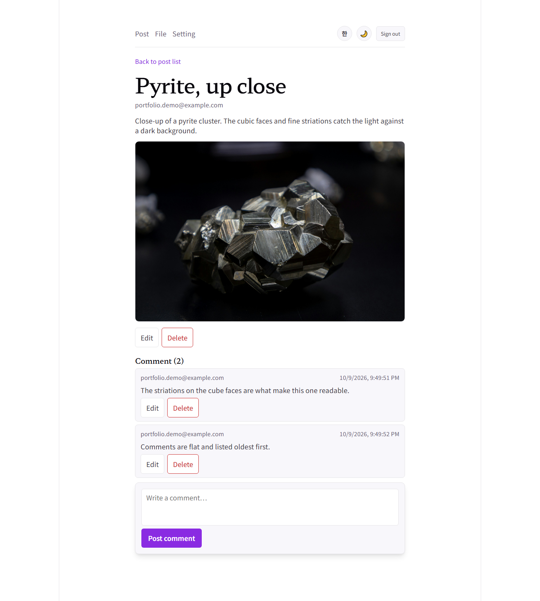<br><sub><b>Post detail</b> — attached media and a flat, oldest-first comment thread</sub></td>
</tr>
<tr>
<td width="50%">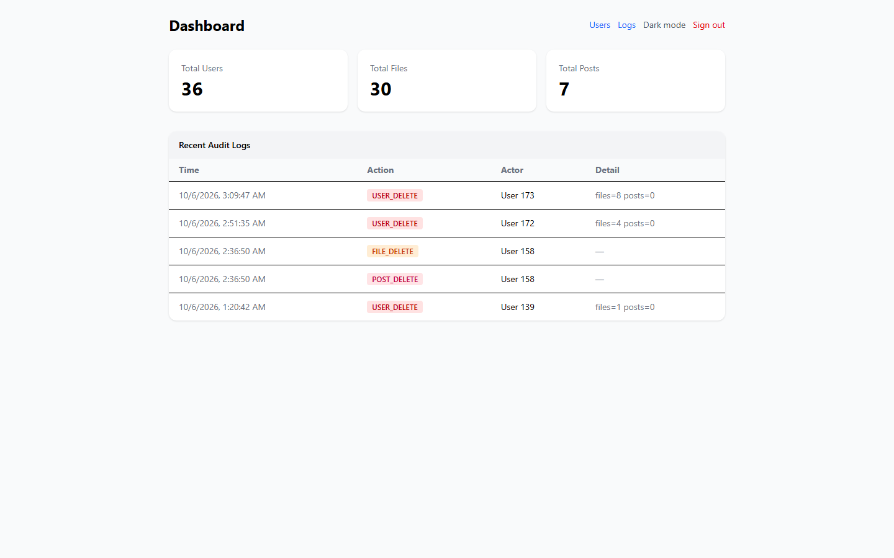<br><sub><b>Admin console</b> — totals and recent audit logs (the admin UI is English only)</sub></td>
<td width="50%">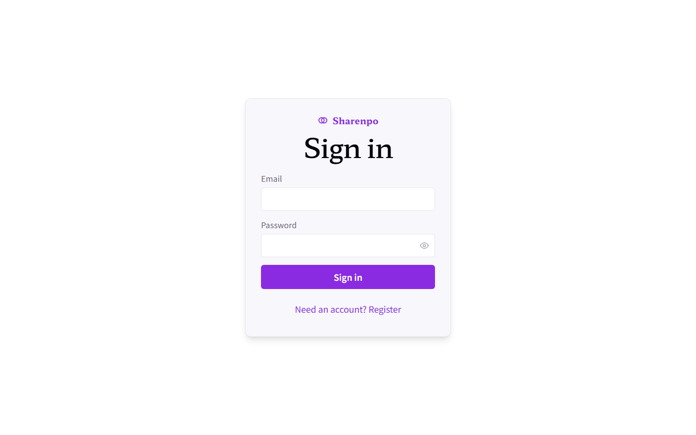<br><sub><b>Sign in</b> — Basic-token sign-in, register toggle, show/hide password</sub></td>
</tr>
<tr>
<td width="50%">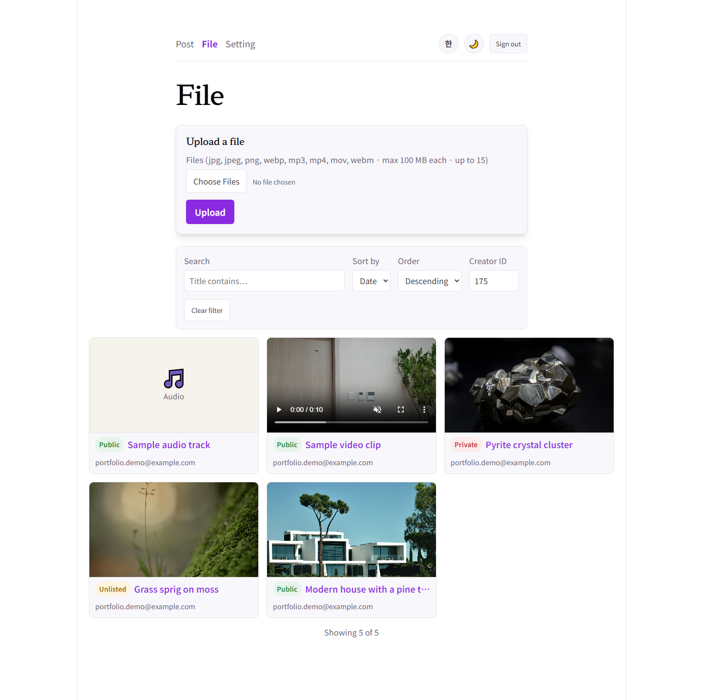<br><sub><b>Mixed media</b> — image, video and audio tiles with Public, Unlisted and Private badges</sub></td>
<td width="50%">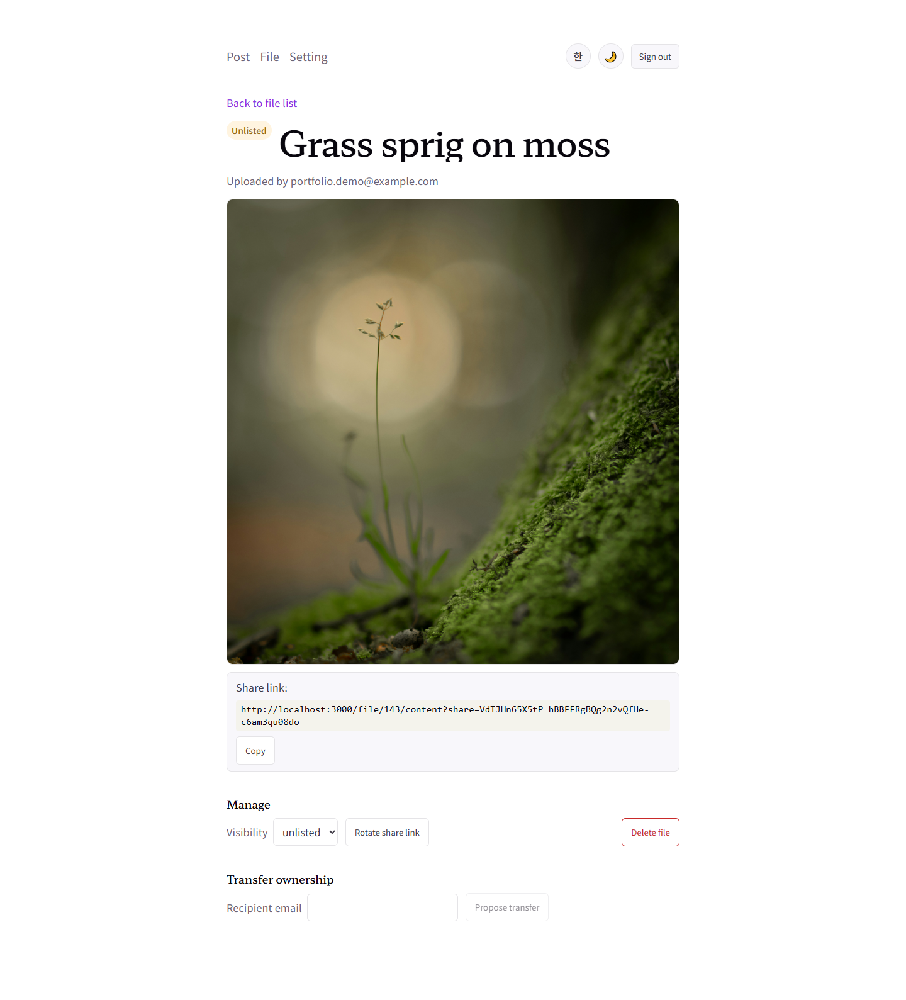<br><sub><b>Unlisted file</b> — opened by a share link whose token can be rotated or given an expiry</sub></td>
</tr>
<tr>
<td width="50%">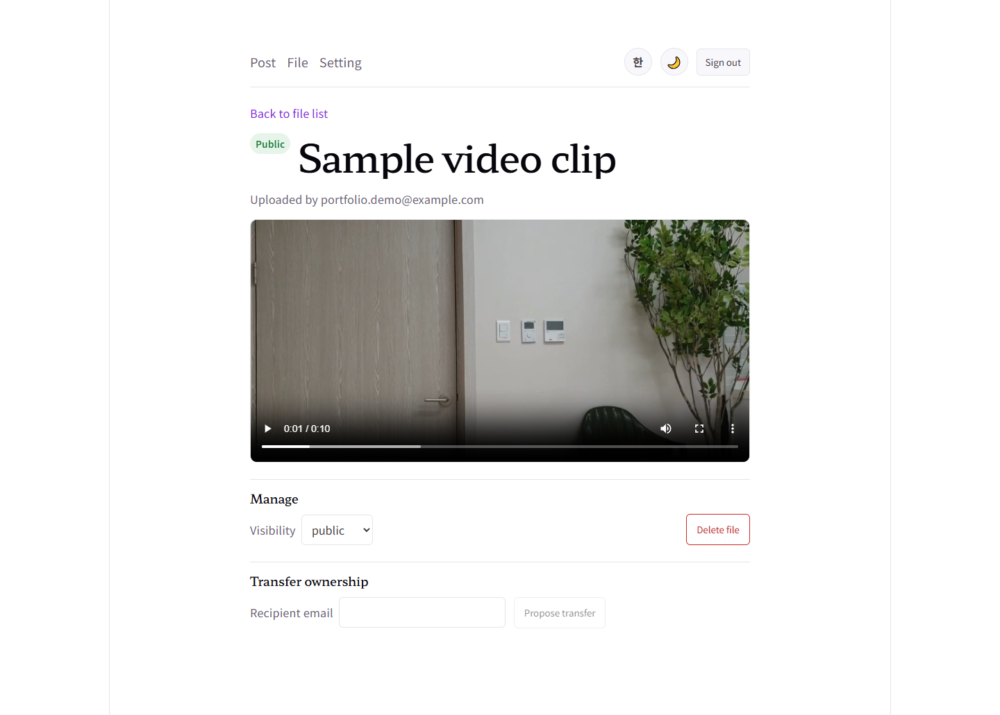<br><sub><b>Video</b> — a public video, served with Range support for seeking</sub></td>
<td width="50%">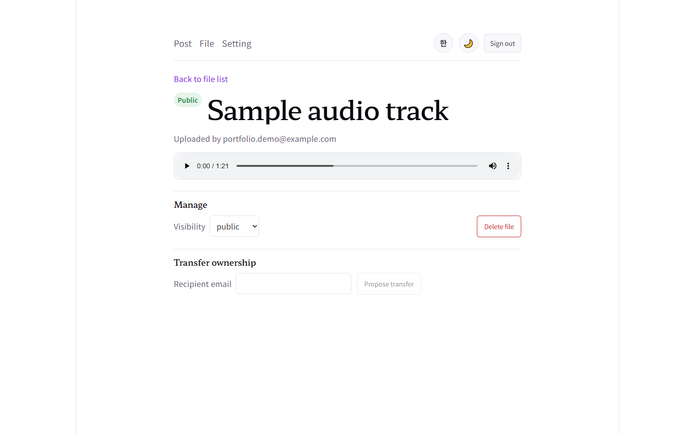<br><sub><b>Audio</b> — a public audio file in the browser's own player</sub></td>
</tr>
</table>

## Documentation

| Document | Purpose |
|---|---|
| [ARCHITECTURE.md](docs/ARCHITECTURE.md) | Module map, request flow, entities, conventions |
| [ADR/](docs/ADR/README.md) | Architecture decision records — the *why* behind the design |
| [CHANGELOG.md](docs/CHANGELOG.md) | Version history |
| [ROADMAP.md](docs/ROADMAP.md) | Full staged project plan and known gaps |
| [CONTRIBUTING.md](docs/CONTRIBUTING.md) | Development workflow and conventions |
| [CLAUDE.md](CLAUDE.md) | Operating contract for AI-assisted development |
| [frontend/README.md](frontend/README.md) | React client — structure, auth model, E2E |
| [admin/README.md](admin/README.md) | Admin console — what was adapted and how it is hosted |
| [k8s/helm/README.md](k8s/helm/README.md) | Helm chart — values, secrets, NetworkPolicy |
| [k8s/infra/terraform/README.md](k8s/infra/terraform/README.md) | Terraform — three states, apply and destroy order |

Each document has a Korean sibling (`*.ko.md`).

## Architecture

One Helm release runs three workloads behind one ALB. The Ingress is an explicit path
allow-list: `/health`, `/metrics` and `/doc` are not routed to it
([ADR 0058](docs/ADR/0058-ingress-path-allowlist.md)).

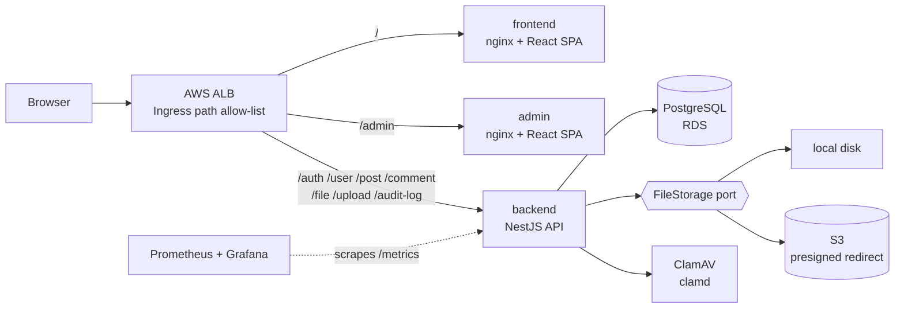

An upload is two requests. The first scans and stages a `temp_` file; the second promotes it in
one transaction and gives it an owner and a visibility
([ADR 0003](docs/ADR/0003-two-phase-upload-contract.md)):

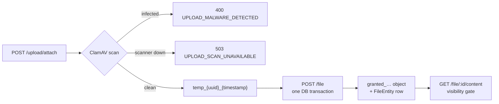

Backend modules, split by single responsibility: **Auth** (tokens), **User**, **File**
(metadata and the visibility gate), **Post**, **Comment**, **Upload** (staging), **AuditLog**,
plus operational modules — **Storage** (the `FileStorage` port with local-disk and S3 adapters),
**TempCleanup** (orphan sweep), **Health** and **Metrics**. See
[ARCHITECTURE.md](docs/ARCHITECTURE.md) for the request and data flow.

## Features

- **Authentication** — register/sign-in via HTTP Basic token; dual-secret JWT
  access/refresh pair with a `type` claim ([ADR 0002](docs/ADR/0002-dual-secret-token-pair.md))
- **Two-phase upload** — `temp_` → `granted_` prefix state machine; the DB insert and
  the physical file move commit or roll back together
  ([ADR 0003](docs/ADR/0003-two-phase-upload-contract.md))
- **RBAC + audit log** — `user`/`admin`/`superadmin` roles; ownership checks
  extend to "self or admin"; role changes and deletes are audited
  ([ADR 0013](docs/ADR/0013-rbac-and-audit-log.md), layered on
  [ADR 0007](docs/ADR/0007-ownership-checks-without-rbac.md))
- **Boundary validation** — global `ValidationPipe` (`whitelist` +
  `forbidNonWhitelisted`); serialized entities never leak `password`
- **Rate limiting** — every route defaults to 100 requests/minute, tracked
  independently per route (not one pool shared app-wide — `@nestjs/throttler`
  keys on controller + handler + client IP); `POST /auth/register`/`signin`/
  `token/refresh` are tightened to 5/minute and `POST /upload/attach` to
  15/minute; health/metrics probes are exempt so orchestrator/Prometheus
  traffic is never mistaken for abuse
  ([ADR 0053](docs/ADR/0053-global-rate-limiting.md),
  [ADR 0054](docs/ADR/0054-per-route-rate-limit-tuning.md))
- **Swagger** — full API documentation and manual test bench at `/doc`
- **Upload malware scanning** — every upload is scanned by ClamAV in memory before anything
  is written. A match is refused, and an unreachable scanner fails closed instead of skipping
  the check ([ADR 0059](docs/ADR/0059-upload-malware-scanning-clamav.md))
- **File visibility** — every file is `public`, `private` (default) or `unlisted`. Unlisted
  files are opened with a share link whose token can be rotated or given an expiry. Bytes are
  served only through the access-checked `GET /file/:id/content`, never from a static folder
  ([ADR 0025](docs/ADR/0025-file-visibility-and-media-expansion.md),
  [ADR 0026](docs/ADR/0026-file-visibility-implementation.md))
- **Storage port** — file operations go through a `FileStorage` interface with a local-disk
  and an S3 adapter, chosen by `STORAGE_DRIVER`. Under S3 a passing access check redirects to a
  short-lived presigned URL, so the app server leaves the byte-serving path
  ([ADR 0029](docs/ADR/0029-storage-port-adapter.md),
  [ADR 0036](docs/ADR/0036-s3-presigned-content-redirect.md))
- **Board** — posts with an optional attached file, and flat comment threads. Lists share one
  search, filter, sort and pagination contract
  ([ADR 0021](docs/ADR/0021-list-query-search-filter-sort.md),
  [ADR 0023](docs/ADR/0023-board-domain-schema.md))
- **Account and file lifecycle** — account deletion cascades only on an explicit
  confirmation, and every delete is irreversible by design
  ([ADR 0020](docs/ADR/0020-account-deletion-cascade.md)). Moving a file to another owner needs
  the recipient's consent: propose, accept, reject or cancel
  ([ADR 0050](docs/ADR/0050-consent-based-file-ownership-transfer.md))
- **Hardening** — security response headers
  ([ADR 0055](docs/ADR/0055-helmet-security-headers.md)), a strength check on token secrets
  and passwords, a non-root container image
  ([ADR 0030](docs/ADR/0030-container-non-root-and-arch-stance.md)), a default-deny
  NetworkPolicy ([ADR 0056](docs/ADR/0056-networkpolicy-east-west-restriction.md)) and the
  Ingress path allow-list above
- **Operations** — liveness/readiness endpoints
  ([ADR 0031](docs/ADR/0031-health-and-readiness-endpoints.md)), Prometheus metrics with
  Grafana ([ADR 0047](docs/ADR/0047-observability-prometheus-grafana.md)), and scheduled
  sweeps for orphaned `temp_` files ([ADR 0018](docs/ADR/0018-orphan-temp-file-cleanup.md))
  and orphaned `granted_` files, which only reports until an operator turns deletion on
  ([ADR 0051](docs/ADR/0051-orphaned-granted-file-reclaim.md))
- **React client (`frontend/`)** — sign-in and register, the post board with comments, the file
  board as a preview grid, playback by media type, visibility and share-link management,
  ownership-transfer actions and account deletion. The upload form takes up to 15 files at
  once and sends them one by one with a progress bar per file
  ([ADR 0065](docs/ADR/0065-multi-file-upload-client-sequential.md)). The UI is English or
  Korean and has a light and a dark theme
- **Admin console (`admin/`)** — login, a dashboard with totals and recent audit logs, the
  user list with role management, and the audit-log viewer. It is served under `/admin` on the
  same ALB ([ADR 0062](docs/ADR/0062-admin-same-alb-subpath-routing.md))

## Tech stack

| Layer | What it uses |
|---|---|
| Backend | NestJS 11 (Express), TypeScript, TypeORM 0.3 with PostgreSQL, Passport JWT with separate access and refresh secrets, bcrypt, class-validator and Joi, `@nestjs/throttler`, helmet, `prom-client`, `clamscan`, AWS SDK v3 (S3 and presigned URLs), Swagger |
| Transactions | Manual QueryRunner where a filesystem move must commit with the DB write, `dataSource.transaction()` for pure DB writes ([ADR 0004](docs/ADR/0004-transaction-pattern-selection.md)). `synchronize: false`, schema by TypeORM migrations ([ADR 0006](docs/ADR/0006-schema-policy-and-migration-adoption.md)) |
| `frontend/` | React 19, Vite, React Router 7, TypeScript, CSS Modules, plain `fetch` wrapper — no state or data-fetching library |
| `admin/` | React 19, Vite, React Router 7, Zustand, axios, TypeScript |
| Tests | Jest unit tests for the services, a backend E2E suite against a real PostgreSQL, Playwright E2E for `frontend/` and `admin/` |
| Containers and CI | Multi-stage Docker images (`linux/amd64` and `linux/arm64` from `main`), Docker Compose, GitHub Actions |
| Deployment | Helm chart, Terraform in three states (`cluster`, `app-infra`, `addons`) — VPC, EKS, RDS, S3, Secrets Manager, Route 53 and ACM, ALB Controller, External Secrets, ExternalDNS, kube-prometheus-stack |

## Quick Start

Prerequisites: Node.js 24 (see [.nvmrc](.nvmrc)) and pnpm 10 via Corepack, plus
PostgreSQL 16 — or just Docker (see [With Docker](#with-docker) below).

```bash
# 1. Install dependencies
pnpm install

# 2. Configure environment
cp .env.example .env        # then fill in DB credentials and token secrets
#    The storage folders (file/temp/, file/upload/) no longer need to be
#    created by hand — LocalDiskStorage creates them on boot if missing.

# 3. Create the database, then apply the schema via migrations (ADR 0006)
#    Create the database named in DB_DATABASE (createdb / pgAdmin), then:
#      pnpm migration:run
#    If your database already carries the schema from the pre-migration era:
#      pnpm migration:run -- --fake     # marks the baseline as applied, once

# 4. Run the dev server (port 3000)
pnpm run start:dev

# 5. Open Swagger UI
#    http://localhost:3000/doc

# 6. (optional) Promote a superadmin account — register it first via
#    POST /auth/register, set SUPERADMIN_EMAIL to that address in .env, then:
#      pnpm promote-superadmin
#    (ADR 0013/0052 — a deliberate manual step, not automatic)

# Tests
pnpm test              # unit tests
pnpm run test:cov      # coverage (only services are measured)
```

### With Docker

`docker compose` brings up Postgres, ClamAV, and the API together
([ADR 0015](docs/ADR/0015-docker-and-compose.md); ClamAV added by
[ADR 0059](docs/ADR/0059-upload-malware-scanning-clamav.md)).
Stop the legacy `upload-board-pg` container first — it holds host port 5435.

```bash
cp .env.example .env        # fill in secrets; DB_* can stay as-is for compose
docker compose up --build   # db (postgres:16) + clamav → migrate (one-shot) → api on :3000
```

The `db` service publishes `${DB_PORT}` (5435), so host-run `pnpm test:e2e` and
`pnpm migration:*` reach the same database. Migrations run as their own `migrate`
service, not inside `api`'s boot ([ADR 0032](docs/ADR/0032-migration-as-separate-deploy-step.md))
— `api` waits for `migrate` to exit 0. The image runs as a non-root user
([ADR 0030](docs/ADR/0030-container-non-root-and-arch-stance.md)); on a native Linux host, if
the bind-mounted `./file` directory fails to write, `chown` it once:
`sudo chown -R 1001:1001 file/` (Windows/Mac Docker Desktop is unaffected).

To change a value only on your machine without touching `.env` — for example
`STORAGE_DRIVER=local` while `.env` points at S3 and the bucket is gone — put it in the
gitignored `.env.local`: `api` and `migrate` read it after `.env`, and so does a host-run
backend ([ADR 0015](docs/ADR/0015-docker-and-compose.md) Addendum 2026-10-03; needs Compose 2.24+).

### Deploying to AWS / Kubernetes

The backend, `frontend/`, and `admin/` ship as one Helm release behind one ALB
([ADR 0060](docs/ADR/0060-frontend-same-alb-path-routing.md),
[ADR 0062](docs/ADR/0062-admin-same-alb-subpath-routing.md)). There are three ways to
run it; exact flags and prerequisites live in
[k8s/infra/terraform/README.md](k8s/infra/terraform/README.md) and
[k8s/helm/README.md](k8s/helm/README.md).

| Way | Command | Use it when |
|---|---|---|
| 1. Scripted | `bash k8s/infra/terraform/deploy.sh all` (or `cluster` / `app-infra` / `addons` / `helm [branch]` one at a time) | The normal path. Runs the three Terraform states in order, then `helm upgrade --install` with the same `:<git-sha>` for all three images ([ADR 0046](docs/ADR/0046-deploy-sequence-automation.md)) |
| 2. By hand | `terraform init -backend-config="bucket=<state-bucket>"`, `plan`, `apply` inside `cluster/`, then `app-infra/`, then `addons/`; then `helm upgrade --install` from `k8s/helm` | You don't want the script — this is exactly the sequence it wraps |
| 3. Helm only | `helm upgrade --install sharenpo . -f values-prod.yaml --set image.tag=<sha> --set frontend.image.tag=<sha> --set admin.image.tag=<sha>` from `k8s/helm` | The infra is already up and the app Secret exists; you only need to redeploy or roll back to an older sha |

`deploy.sh` stops for an explicit `y` before every `apply` — there is no `-auto-approve`.
None of the three covers domain purchase / NS delegation, the one-time External Secrets
sync, or turning `ingress.enabled` on; those stay manual (see the Terraform README).

**CI does not deploy.** GitHub Actions only publishes the three images
(`bluecode1775/sharenpo`, `-frontend`, `-admin`) to Docker Hub
([ADR 0048](docs/ADR/0048-ci-trigger-restoration-and-docker-publish-design.md)); nothing in
this repository runs `terraform apply` or `helm upgrade` automatically.

This stack has been applied to real AWS and verified there more than once. This README does
not say whether it is up right now, because that goes stale the day someone runs `apply` or
`destroy`; the dated log is [ROADMAP.md](docs/ROADMAP.md) §9, and the live state is read from
AWS.

### Environment variables

Required (Joi-validated at boot — missing vars fail fast): `ENV`, `DB_TYPE`
(`postgres`), `DB_HOST`, `DB_PORT`, `DB_USERNAME`, `DB_PASSWORD`, `DB_DATABASE`,
`HASH_ROUNDS`, `ACCESS_TOKEN_SECRET`, `REFRESH_TOKEN_SECRET`,
`ACCESS_TOKEN_SECRET_EXPIRES_IN`, `REFRESH_TOKEN_SECRET_EXPIRES_IN`. Since
2026-09-11, validation goes beyond presence for three of these: `HASH_ROUNDS` must be
`>= 10`, and `ACCESS_TOKEN_SECRET`/`REFRESH_TOKEN_SECRET` must each be at least 32
characters and contain a lowercase letter, an uppercase letter, a digit, and a symbol —
a weaker value fails at boot with a Joi error naming the field.

Optional (all Joi-validated with a default, or gated by their own condition — see
`.env.example` for the full list with examples): `BASE_URL` (default
`http://localhost:3000`; composes public file URLs), `PORT` (default `3000`),
`CORS_ORIGIN` (unset = CORS disabled; comma-separated allowlist —
[ADR 0008](docs/ADR/0008-opt-in-cors.md); the deployed `frontend/` doesn't set this — it's
same-origin behind the same ALB as the API,
[ADR 0060](docs/ADR/0060-frontend-same-alb-path-routing.md) — `admin/`'s dev server and any
other cross-origin consumer still need it), `SUPERADMIN_EMAIL` (unset = disabled;
the target account for the manual `pnpm promote-superadmin` step, not an
automatic boot-time promotion —
[ADR 0013](docs/ADR/0013-rbac-and-audit-log.md)/[ADR 0052](docs/ADR/0052-superadmin-seed-manual-trigger.md)), `TEMP_SWEEP_ENABLED` /
`TEMP_SWEEP_CRON` / `TEMP_SWEEP_TTL_HOURS` / `TEMP_SWEEP_DRY_RUN` (orphan temp-file
sweep — [ADR 0018](docs/ADR/0018-orphan-temp-file-cleanup.md)), `STORAGE_DRIVER`
(`local` default | `s3`, with `S3_BUCKET`/`AWS_REGION` required when `s3` —
[ADR 0029](docs/ADR/0029-storage-port-adapter.md)), `CONTENT_SIGNED_URL_TTL_SECONDS` (S3 presigned-redirect TTL, unused under `local` —
[ADR 0036](docs/ADR/0036-s3-presigned-content-redirect.md)), `CLAMD_HOST` / `CLAMD_PORT`
(default `clamav` / `3310`, matching the `docker-compose.yml` service name — upload
malware scanning, [ADR 0059](docs/ADR/0059-upload-malware-scanning-clamav.md)), and `THROTTLE_ENABLED`
(default `true` — not a dev/prod switch; exists only so the e2e suite can bypass the
global rate limit and the tighter per-route auth/upload limits —
[ADR 0053](docs/ADR/0053-global-rate-limiting.md),
[ADR 0054](docs/ADR/0054-per-route-rate-limit-tuning.md)).

## API Endpoints

Every endpoint requires a Bearer access token except `/auth/*`, the operational `/health/*` and
`/metrics`, and `GET /file/:id/content`, whose access depends on the file's visibility (it
takes an optional token). Swagger lists every route at `/doc`.

**Authentication** — the refresh token travels only as an httpOnly cookie
(`SameSite=Strict`, `Path=/auth/token`); browsers must call refresh/signout with
`credentials: 'include'` ([ADR 0012](docs/ADR/0012-refresh-cookie-rotation.md))
- `POST /auth/register` — register with a Basic token (`base64(email:password)`)
- `POST /auth/signin` — get `{ accessToken }` + refresh cookie (Basic token)
- `POST /auth/token/refresh` — rotates the refresh cookie, returns a new access
  token; replaying a rotated-out token invalidates the session (`AUTH_REFRESH_REUSED`)
- `POST /auth/signout` — invalidates the server-side session anchor and clears
  the cookie (Bearer access token)

**User** — user creation is `POST /auth/register`; there is no `POST /user`.
Roles: `user` / `admin` / `superadmin` ([ADR 0013](docs/ADR/0013-rbac-and-audit-log.md))
- `GET /user` — list users (admin only). `take` (1–100, default 20) and `skip` (default 0)
  paginate; `search` does a case-insensitive partial match on email (wildcards escaped);
  `sortBy` (`createdAt`|`email`|`id`, default `createdAt`) and `order` (`ASC`|`DESC`,
  default `DESC`) control sort, with `id` always added as a tiebreaker — the same
  search/sort shape `GET /file` already has
  ([ADR 0021](docs/ADR/0021-list-query-search-filter-sort.md)). An undeclared query param is
  rejected as 400 `VALIDATION_FAILED` rather than silently ignored — the global
  `ValidationPipe`'s `forbidNonWhitelisted` treats a typo like `?orderby=email` as an
  error. Response is a `[users, totalCount]` tuple, matching `GET /file`
- `GET /user/lookup?email=` — resolve an exact email to a user. Any signed-in user may call it,
  with the same per-user disclosure as `GET /user/:id`; 404 `USER_NOT_FOUND` if no account has
  that email. It lets the ownership-transfer form find its recipient
  ([ADR 0050](docs/ADR/0050-consent-based-file-ownership-transfer.md))
- `GET /user/:id` — get a user
- `PATCH /user/:id` — update a user (self, or an admin/superadmin acting on a
  strictly lower-ranked account — an admin cannot modify a peer admin or a superadmin)
- `PATCH /user/:id/role` — assign a role (superadmin only; the last superadmin cannot be demoted)
- `DELETE /user/:id` — delete a user (self, or an admin/superadmin acting on a
  strictly lower-ranked account, with the same peer/higher-rank restriction as above).
  An account that owns files is
  refused with 409 `USER_HAS_FILES` unless the request confirms the cascade with
  `?deleteFiles=true`, which deletes the account together with its files — irreversibly
  ([ADR 0020](docs/ADR/0020-account-deletion-cascade.md)). The account's **posts are always
  deleted with it**, with no confirmation of their own: the flag deliberately guards
  media bytes only ([ADR 0023](docs/ADR/0023-board-domain-schema.md)). A confirmed cascade is
  still refused with 409 `USER_FILES_IN_USE` when one of the account's files is attached
  to *another user's* post — delete that post first
  ([ADR 0024](docs/ADR/0024-account-cascade-fk-refusal.md))

**File**
- `POST /upload/attach` — upload a file to temp storage, 100 MB limit. Exactly one of three
  multipart fields, each with its own class allowlist: `image` (jpg/jpeg/png/webp), `audio`
  (mp3), `video` (mp4/mov/webm). Zero fields is 400 `UPLOAD_FILE_REQUIRED`; more than one is
  400 `UPLOAD_MULTIPLE_FIELDS`; a file that does not match its field's allowlist is 400
  `UPLOAD_INVALID_TYPE` ([ADR 0025](docs/ADR/0025-file-visibility-and-media-expansion.md) D4/D5,
  [ADR 0027](docs/ADR/0027-media-type-expansion-implementation.md)). Before the file ever
  reaches temp storage, it's scanned by ClamAV (`clamd`) — a positive match is 400
  `UPLOAD_MALWARE_DETECTED`; if the scanner can't be reached or times out, the upload fails
  closed with 503 `UPLOAD_SCAN_UNAVAILABLE` rather than skipping the check
  ([ADR 0059](docs/ADR/0059-upload-malware-scanning-clamav.md))
- `GET /file` — list files. All query parameters are optional and combinable; an undeclared
  one is rejected as 400 `VALIDATION_FAILED` ([ADR 0021](docs/ADR/0021-list-query-search-filter-sort.md))

  | Parameter | Values | Default |
  |---|---|---|
  | `take` | 1–100 | `20` |
  | `skip` | ≥ 0 | `0` |
  | `search` | title substring, case-insensitive, ≤100 chars (`%` and `_` match literally) | — |
  | `sortBy` | `createdAt` \| `title` \| `id` | `createdAt` |
  | `order` | `DESC` \| `ASC` | `DESC` |
  | `creatorId` | user id | — |

  Example: `GET /file?search=holiday&creatorId=3&sortBy=title&order=ASC&take=10`
- `GET /file/:id` — get file metadata. A `private`/`unlisted` file is 404 `FILE_NOT_FOUND`
  for anyone but its creator/admin — existence itself is hidden
  ([ADR 0025](docs/ADR/0025-file-visibility-and-media-expansion.md),
  [ADR 0026](docs/ADR/0026-file-visibility-implementation.md))
- `GET /file/:id/content` — stream the file's stored bytes, gated by `visibility`: `public`
  needs no auth, `private` needs a creator/admin Bearer token (403
  `FORBIDDEN_NOT_OWNER` otherwise), `unlisted` needs a matching `?share=<token>` (no login
  required; 403 `FILE_SHARE_INVALID` if missing/wrong/expired). Supports `Range` requests
  for video/audio seeking. This is the **only** path that serves granted bytes —
  `ServeStaticModule` no longer exposes `file/upload`
  ([ADR 0025](docs/ADR/0025-file-visibility-and-media-expansion.md) D1/D2,
  [ADR 0026](docs/ADR/0026-file-visibility-implementation.md)). Under `STORAGE_DRIVER=s3`,
  a passing access check returns a `302` redirect to a short-lived presigned S3 URL
  instead of streaming the bytes itself; under the default `local` driver, behavior is
  unchanged ([ADR 0036](docs/ADR/0036-s3-presigned-content-redirect.md))
- `POST /file` — promote a temp file to permanent storage (transactional), defaulting to
  `visibility: private`. The attached filename is a one-shot claim token: resubmitting it
  returns the existing file with 200 (idempotent retry) for the user who claimed it, and
  409 `FILE_ALREADY_CLAIMED` for anyone else ([ADR 0019](docs/ADR/0019-upload-claim-idempotency.md)).
  The response's `mediaType` (`image`/`audio`/`video`) is derived from the file's extension
  server-side, never client-supplied ([ADR 0040](docs/ADR/0040-persisted-media-type-for-playback.md))
- `PATCH /file/:id` — update file metadata (creator or admin), including toggling
  `visibility`. Switching to `unlisted` issues a `shareToken` (returned as `shareUrl`, owner/
  admin only); `rotateShareToken: true` regenerates it, invalidating every previously shared
  link; an optional `shareExpiresAt` bounds it (default: no expiry)
  ([ADR 0025](docs/ADR/0025-file-visibility-and-media-expansion.md) D3)
- `DELETE /file/:id` — delete file metadata and the stored file (creator or admin). A file
  attached to a post is refused with 409 `FILE_IN_USE` — delete the post first
  ([ADR 0023](docs/ADR/0023-board-domain-schema.md))
- `POST /file/:id/transfer` — propose moving the file to another user (`{ userId }`; creator or
  admin). Nothing moves yet. 400 `FILE_TRANSFER_INVALID_TARGET` if the target already owns it,
  404 `USER_NOT_FOUND` for an unknown target, 409 `FILE_TRANSFER_PENDING` if a proposal is
  already waiting ([ADR 0050](docs/ADR/0050-consent-based-file-ownership-transfer.md))
- `POST /file/:id/transfer/accept` and `POST /file/:id/transfer/reject` — answer a pending
  proposal. Only the proposed recipient may do so, and an admin cannot answer for them (403
  `FORBIDDEN_NOT_TRANSFER_TARGET`). Accepting moves ownership to the caller; 400
  `FILE_NO_PENDING_TRANSFER` if nothing is pending
- `DELETE /file/:id/transfer` — cancel an unanswered proposal. Only the file's creator may; an
  admin cannot cancel someone else's proposal (403 `FORBIDDEN_NOT_OWNER`)

**Post** — the board itself ([ADR 0023](docs/ADR/0023-board-domain-schema.md)). A post carries
text plus an optional reference to **one** file the author created; the file is *referenced*,
never owned, so deleting a post leaves it intact
- `GET /post` — list posts. Same query-parameter contract as `GET /file` above
  (`take` / `skip` / `search` / `sortBy` / `order` / `creatorId`), with the same defaults
- `GET /post/:id` — get a post with its author and attached file
- `POST /post` — create a post (`{ title, body, fileId? }`). `fileId` must be a file the
  requester created (403 `FORBIDDEN_NOT_OWNER` otherwise, 404 `FILE_NOT_FOUND` if it does not
  exist) and one no other post holds. It doubles as the idempotency key: resubmitting the
  **identical** payload returns the existing post with 200, while the same `fileId` with
  different text is 409 `POST_FILE_TAKEN`. A post without `fileId` has no natural key, so a
  repeat creates a second post
- `PATCH /post/:id` — update `title` / `body` (author or admin). The attachment is fixed at
  creation; detaching a video means deleting the post
- `DELETE /post/:id` — delete a post (author or admin), irreversibly. Its comments go with
  it through the FK cascade; its attached file does not

**Comment** — the thread under a post ([ADR 0023](docs/ADR/0023-board-domain-schema.md)). Flat —
there are no replies to replies
- `GET /post/:postId/comment` — list one post's comments, **oldest first** (the opposite of
  the newest-first file and post lists; the order is fixed and takes no sort parameters).
  `take` / `skip` paginate. 404 `POST_NOT_FOUND` if the post does not exist
- `POST /post/:postId/comment` — comment on a post (`{ body }`, ≤1,000 chars). 404
  `POST_NOT_FOUND` if the post is gone. A comment has no unique column and therefore no
  idempotency key, so an identical resubmission creates a **second** comment
- `PATCH /comment/:id` — update `body` (author or admin)
- `DELETE /comment/:id` — delete a comment (author or admin), irreversibly. The post is
  untouched

A post's author gets **no** special power over the comments on their post — editing and
deleting are the comment author's or an admin's, and nobody else's.

**Audit log**
- `GET /audit-log` — review ROLE_CHANGE / USER_DELETE / FILE_DELETE / POST_DELETE /
  COMMENT_DELETE records (admin only; paginated, `?action` filter). `?userId` returns
  only records where that user was the actor, or was the target of a **user-targeting**
  action — `targetId` is polymorphic, so a record whose target is a file, post, or
  comment matches only via the actor side ([ADR 0045](docs/ADR/0045-audit-log-target-type.md)).
  The two filters AND together when both are given

**Health** (operational — for load-balancer/orchestrator probes, not application
consumers; unauthenticated by design, [ADR 0031](docs/ADR/0031-health-and-readiness-endpoints.md))
- `GET /health/live` — the process is running; no dependency checks
- `GET /health/ready` — additionally checks DB connectivity; 503 if unreachable

**Metrics** (operational — for Prometheus scraping, not application consumers;
unauthenticated by design, [ADR 0047](docs/ADR/0047-observability-prometheus-grafana.md))
- `GET /metrics` — Prometheus exposition format: default process metrics, per-request
  duration (`http_request_duration_seconds`), and app counters (`upload_claims_total`,
  `temp_cleanup_deleted_total`)

### Typical flow

```
POST /auth/register   (Basic)          → user created
POST /auth/signin     (Basic)          → { accessToken } + Set-Cookie: refreshToken (httpOnly)
POST /upload/attach   (Bearer, one of image/audio/video) → { filename: "temp_..." }
POST /file            (Bearer, { title, filePath: "temp_..." })
                                       → promoted (visibility: private); served at
                                         {BASE_URL}/file/:id/content (Bearer required until
                                         PATCH /file/:id sets visibility to public/unlisted)
```

### Error responses

Every error follows a frozen machine-readable shape
([ADR 0011](docs/ADR/0011-error-code-contract.md)):

```json
{
  "statusCode": 400,
  "code": "FILE_TITLE_TAKEN",
  "message": "Title already in use.",
  "timestamp": "2026-07-23T09:00:00.000Z",
  "path": "/file/1"
}
```

Branch on `code` (stable contract — see `backend/common/error-code.ts`), never on
`message` (free to change). Validation failures use `code: "VALIDATION_FAILED"`
with a `message` array; when `ENV=dev` a `stack` field is included.

See [ARCHITECTURE.md](docs/ARCHITECTURE.md) for the full request and data flow.

## Testing and CI

- **Unit tests** — Jest, colocated as `*.spec.ts`. Only the services are measured for coverage;
  repositories and the QueryRunner are mocked, so no database is needed (`pnpm test`).
- **Backend E2E** — `pnpm test:e2e` runs the real app against a real PostgreSQL. It builds a
  throwaway `sharenpo_e2e` database from the real migrations, truncates it between tests and
  drops it afterwards; the dev database is never touched.
- **Client E2E** — Playwright in `frontend/` and `admin/` (see each folder's README).
- **GitHub Actions** ([ADR 0016](docs/ADR/0016-github-actions-ci.md),
  [ADR 0048](docs/ADR/0048-ci-trigger-restoration-and-docker-publish-design.md)) — lint and unit
  tests, backend E2E against a PostgreSQL service and a ClamAV service, lint and E2E for each
  client, then image publishing for the backend, `frontend/` and `admin/`. Before an image is
  pushed, the built image is booted against a throwaway database and its `HEALTHCHECK` is
  polled until healthy.
- There is no deploy pipeline and there are no git hooks. CI stops at publishing images.

## Known limitations

Open items, each recorded where it was found. The full list is in
[ROADMAP.md](docs/ROADMAP.md) §7 and CLAUDE.md > Known Gaps.

- **A scan result of "unable to scan" passes the upload gate.** `clamscan` can answer
  `isInfected: null` when `clamd` closes the connection with an empty reply or a command times
  out, and the gate reads that as clean, so the file is stored unscanned. Connection errors and
  an unreachable scanner still fail closed. Read from source, not reproduced against a real
  `clamd`; the planned fix is small and scoped
  ([ADR 0059](docs/ADR/0059-upload-malware-scanning-clamav.md), addendum 2026-10-03).
- **An unclaimed upload filename is not bound to its uploader.** Between `POST /upload/attach`
  and the first `POST /file`, any signed-in user who knows the `temp_` filename can claim it,
  and the uploader then gets 409 `FILE_ALREADY_CLAIMED`. Reproduced locally. Assessed low: the
  name carries a v4 UUID, travels only in request and response bodies, and expires with the
  temp sweep (24 hours by default)
  ([ADR 0019](docs/ADR/0019-upload-claim-idempotency.md), addendum 2026-10-06).
- **A refresh can race across browser tabs.** The server keeps one refresh anchor per account
  and has no grace window. The client serializes refreshes inside one tab, so two tabs
  refreshing at the same instant could end the session. One attempt did not reproduce it.
- **An interrupted upload restarts from zero.** Each upload is one buffered request, and there
  is no resumable or chunked upload; none is designed.
- **A post references at most one file.** Several files on one post is a schema change that
  has not been decided ([ADR 0065](docs/ADR/0065-multi-file-upload-client-sequential.md) D5).
- **Registration reveals that an email is taken** (`AUTH_EMAIL_TAKEN`), while sign-in hides
  why it failed. This was weighed and accepted, because the client shows a specific message for
  it and the 5/minute limit is the only mitigation ([ROADMAP.md](docs/ROADMAP.md) §7).
- **Rate-limit counters live in each instance's memory.** More than one replica would need
  shared storage to keep one real ceiling
  ([ADR 0053](docs/ADR/0053-global-rate-limiting.md)).
- **Public and unlisted media does not render in the local dev setup.** Locally the client runs
  on `:5173` and the API on `:3000`, file URLs point at `:3000`, and the API's helmet default
  sends `Cross-Origin-Resource-Policy: same-origin`, so the browser refuses to embed those files
  directly. Private files still show, because the client fetches them through the dev proxy.
  The screenshots above were taken with that one header relaxed in the capture browser. Behind
  one ALB the client and the API share an origin ([ADR 0060](docs/ADR/0060-frontend-same-alb-path-routing.md)),
  so the problem is not expected there, but it has not been observed in a browser on the
  deployed stack.
- **Delivery stops at images.** A person runs the deploy, and a service mesh (Istio) was
  deliberately left out because this project has one backend workload and no east-west
  traffic for it to manage.
- **Dependencies.** `pnpm audit --prod` found no known vulnerabilities on 2026-10-09. A plain
  `pnpm audit` reported 65 that day (3 critical), all in build and test tooling.

## License

[MIT](LICENSE)

## Author

BLUECODE77732 — https://github.com/Bluecode77732
